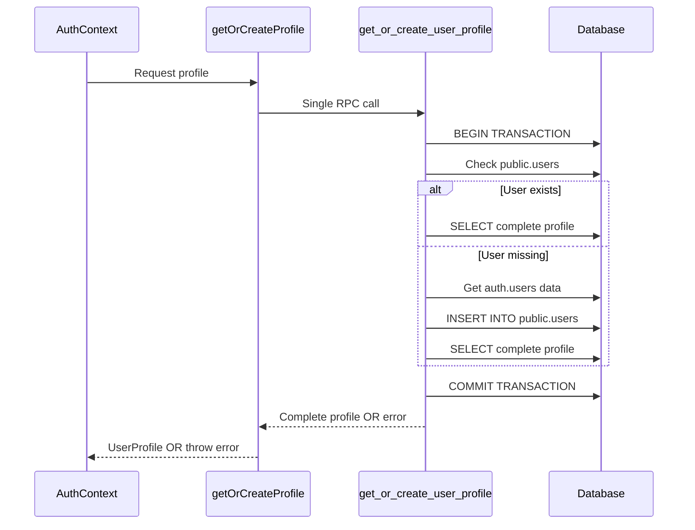

# Design Document

## Overview

The Atomic Profile Management system represents a fundamental architectural shift from multi-step, client-orchestrated profile operations to a single, atomic database-driven approach. This design eliminates the current three-step process (`SELECT` → `RPC` → `SELECT`) that creates race conditions and data inconsistency issues, replacing it with a single atomic RPC function that handles all profile logic within the database transaction boundary.

**Current Architecture Problems:**
- Complex multi-step client logic in `getOrCreateProfile` function
- Race conditions between profile lookup and creation
- Partial failure scenarios leading to incomplete data
- Network round-trip overhead with multiple database calls
- Inconsistent error handling across different failure points

**New Architecture Benefits:**
- Single atomic operation with ACID guarantees
- Simplified client code with single RPC call
- Centralized business logic in database layer
- Consistent error handling and reporting
- Improved performance with reduced network calls

## Architecture

### High-Level Architecture Diagram

```mermaid
graph TB
    subgraph "Client Layer"
        A[AuthContext] --> B[getOrCreateProfile]
        B --> C[Single RPC Call]
    end
    
    subgraph "Database Layer"
        C --> D[get_or_create_user_profile RPC]
        D --> E[Atomic Transaction]
        E --> F[User Lookup]
        E --> G[Conditional Creation]
        E --> H[Final Data Return]
    end
    
    subgraph "Data Flow"
        I[auth.uid()] --> D
        D --> J[Complete UserProfile]
        D --> K[Specific Error]
    end
```

### Component Interaction Flow



### Data Consistency Model

The atomic approach ensures that profile operations follow ACID properties:

- **Atomicity**: All profile operations (lookup, creation, data retrieval) happen in a single transaction
- **Consistency**: Database constraints are enforced throughout the operation
- **Isolation**: Concurrent profile requests don't interfere with each other
- **Durability**: Once committed, profile data is permanently stored

## Components and Interfaces

### 1. Database RPC Function: `get_or_create_user_profile`

**Purpose**: Single atomic function that handles all profile operations within the database

**Function Signature**:
```sql
CREATE OR REPLACE FUNCTION get_or_create_user_profile()
RETURNS TABLE (
    "authId" UUID,
    "dbId" UUID,
    "employeeId" TEXT,
    "email" TEXT,
    "name" TEXT,
    "department" TEXT,
    "role" user_role,
    "createdAt" TIMESTAMPTZ,
    "updatedAt" TIMESTAMPTZ
)
```

**Key Features**:
- Uses `auth.uid()` internally for security
- Handles user lookup and creation atomically
- Returns complete profile data or specific errors
- Manages concurrent access with proper conflict resolution
- Provides detailed error messages for debugging

**Internal Logic Flow**:
1. Validate authentication using `auth.uid()`
2. Check if user exists in `public.users`
3. If missing, safely create user with data from `auth.users`
4. Return complete profile data with all required fields
5. Handle all edge cases with specific error messages

### 2. Simplified Frontend Function: `getOrCreateProfile`

**Current Implementation** (Complex, 50+ lines):
```typescript
async function getOrCreateProfile(supabase: SupabaseClient, user: User): Promise<UserProfile> {
  // Complex multi-step logic with error handling
  // Multiple database calls
  // Conditional branching
  // Manual data validation
}
```

**New Implementation** (Simple, <20 lines):
```typescript
async function getOrCreateProfile(supabase: SupabaseClient): Promise<UserProfile> {
  const { data, error } = await supabase.rpc('get_or_create_user_profile').single();
  
  if (error) {
    console.error("CRITICAL: get_or_create_user_profile RPC failed.", error);
    throw error;
  }
  
  if (!data) {
    throw new Error("get_or_create_user_profile RPC returned no data.");
  }
  
  return {
    authId: createAuthId(data.authId),
    dbId: createDatabaseUserId(data.dbId),
    employeeId: data.employeeId,
    email: data.email,
    name: data.name,
    department: data.department,
    role: data.role,
    createdAt: data.createdAt,
    updatedAt: data.updatedAt,
  };
}
```

### 3. AuthContext Integration

**Simplified Event Handler**:
```typescript
const { data: { subscription } } = supabase.auth.onAuthStateChange(async (event, session) => {
  // ... existing safety checks ...
  
  try {
    if (session?.user) {
      // Single RPC call - no user parameter needed
      const profile = await getOrCreateProfile(supabase);
      
      if (!isMounted) return;
      
      setUser(session.user);
      setUserProfile(profile);
      setAuthStatus('authenticated');
    } else {
      // ... logout logic unchanged ...
    }
  } catch (error) {
    // ... error handling unchanged ...
  }
});
```

## Data Models

### Input Data Sources

**From `auth.users` table**:
```sql
{
  id: UUID,
  email: TEXT,
  raw_user_meta_data: JSONB {
    fullName?: string,
    full_name?: string,
    department?: string
  }
}
```

**From `public.users` table**:
```sql
{
  id: UUID,
  auth_id: UUID,
  employee_id: TEXT,
  email: TEXT,
  name: TEXT,
  department: TEXT,
  role: user_role,
  created_at: TIMESTAMPTZ,
  updated_at: TIMESTAMPTZ
}
```

### Output Data Model

**RPC Function Return Type**:
```typescript
interface AtomicProfileResult {
  authId: string;      // UUID from auth_id
  dbId: string;        // UUID from id
  employeeId: string | null;
  email: string;
  name: string;
  department: string;
  role: 'admin' | 'employee';
  createdAt: string;   // ISO timestamp
  updatedAt: string | null;
}
```

**Final UserProfile Type** (unchanged):
```typescript
interface UserProfile {
  authId: AuthId;      // Branded type
  dbId: DatabaseUserId; // Branded type
  employeeId?: string;
  email: string;
  name: string;
  department: string;
  role: 'admin' | 'employee';
  createdAt: string;
  updatedAt?: string;
}
```

## Error Handling

### Database-Level Error Handling

The RPC function handles all error scenarios with specific, actionable messages:

1. **Authentication Errors**:
   ```sql
   RAISE EXCEPTION 'Authentication required: User is not logged in.';
   ```

2. **Critical Data Inconsistency**:
   ```sql
   RAISE EXCEPTION 'Critical error: User not found in auth.users despite being authenticated.';
   ```

3. **Profile Creation Failures**:
   ```sql
   RAISE EXCEPTION 'Failed to create or find user profile after insert attempt.';
   ```

### Frontend Error Propagation

The simplified frontend function maintains clean error propagation:

```typescript
if (error) {
  console.error("CRITICAL: get_or_create_user_profile RPC failed.", error);
  throw error; // Propagate to AuthContext
}
```

### AuthContext Error Handling

Existing error handling in AuthContext remains unchanged:

```typescript
catch (error) {
  console.error(`[AuthProvider] Exception caught during event '${event}'.`, error);
  if (isMounted) {
    setUser(null);
    setUserProfile(null);
    setAuthStatus('unauthenticated');
  }
}
```

## Testing Strategy

### Database Function Testing

1. **Unit Tests for RPC Function**:
   - Test with authenticated user
   - Test with unauthenticated user
   - Test with existing user profile
   - Test with missing user profile
   - Test with incomplete auth.users data
   - Test concurrent access scenarios

2. **Integration Tests**:
   - Test complete auth flow with new RPC
   - Test error propagation through all layers
   - Test performance compared to old implementation

### Frontend Testing

1. **getOrCreateProfile Function Tests**:
   - Test successful RPC call
   - Test RPC error handling
   - Test data transformation
   - Test type safety with branded types

2. **AuthContext Integration Tests**:
   - Test login flow with new atomic function
   - Test page refresh scenarios
   - Test concurrent authentication attempts
   - Test error recovery scenarios

### Performance Testing

1. **Benchmark Comparisons**:
   - Old multi-step approach vs new atomic approach
   - Network call reduction measurement
   - Database transaction time analysis
   - Concurrent user load testing

2. **Reliability Testing**:
   - Race condition elimination verification
   - Data consistency under high load
   - Error rate comparison between implementations

## Migration Strategy

### Phase 1: Database Function Deployment

1. Create new migration file for atomic RPC function
2. Deploy function alongside existing `upsert_user_profile`
3. Test new function in isolation
4. Verify backward compatibility

### Phase 2: Frontend Integration

1. Update `getOrCreateProfile` function implementation
2. Remove user parameter dependency
3. Test with existing AuthContext integration
4. Verify all existing functionality works

### Phase 3: Cleanup and Optimization

1. Remove old `upsert_user_profile` function
2. Clean up unused code paths
3. Update documentation and comments
4. Performance monitoring and optimization

### Rollback Plan

If issues arise, rollback involves:
1. Revert frontend `getOrCreateProfile` to previous implementation
2. Keep both RPC functions available during transition
3. Monitor for any data inconsistencies
4. Remove new RPC function if necessary

This atomic profile management design provides a robust, performant, and maintainable solution that eliminates the current data reliability issues while dramatically simplifying the client-side code.