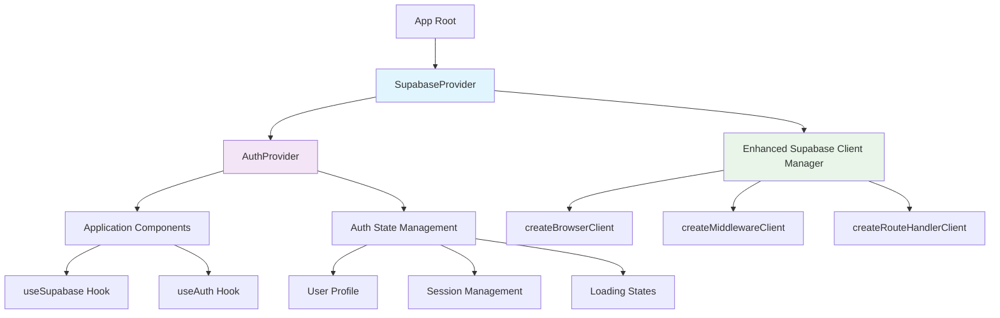

# Design Document

## Overview

This design document outlines the comprehensive integration of AuthContext throughout the application, addressing TypeScript errors and establishing a unified authentication architecture. The solution separates concerns between Supabase client management and authentication state management while maintaining backward compatibility and performance optimization.

## Architecture

### Current State Analysis

The current implementation has several issues:
1. **Mixed patterns**: Some components use AuthContext while others directly use Supabase clients
2. **Type errors**: Missing type definitions in middleware.ts and MagicLinkHandler.tsx
3. **Performance concerns**: AuthContext potentially causing unnecessary re-renders
4. **Inconsistent client creation**: Multiple ways of creating Supabase clients

### Proposed Architecture



## Components and Interfaces

### 1. SupabaseProvider (New)

**Purpose**: Centralized Supabase client management separate from auth state

```typescript
interface SupabaseContextType {
  client: SupabaseClient<Database>;
  isReady: boolean;
  error: Error | null;
  reinitialize: () => Promise<void>;
}

interface SupabaseProviderProps {
  children: ReactNode;
}
```

**Key Features**:
- Uses existing EnhancedSupabaseClientManager
- Provides single client instance across the app
- Handles client initialization errors
- Supports client reinitialization

### 2. Enhanced AuthProvider

**Purpose**: Focused authentication state management with performance optimization

```typescript
interface AuthContextType {
  user: User | null;
  userProfile: UserProfile | null;
  authStatus: 'loading' | 'authenticated' | 'unauthenticated';
  // Removed: supabase client (now in SupabaseProvider)
}
```

**Key Improvements**:
- Memoized values to prevent unnecessary re-renders
- Separated from Supabase client management
- Optimized session polling for PWA environments
- Enhanced error handling with specific error types

### 3. Type-Safe Middleware

**Purpose**: Resolve TypeScript errors and improve type safety

```typescript
// Fixed type issues
interface MiddlewareAuthContext {
  isAuthenticated: boolean;
  userRole: UserRole | undefined;
  userId: string | undefined;
  sessionExpiry: Date | null; // Properly typed
}
```

**Key Fixes**:
- Proper typing for `session.expires_at`
- Remove unused imports
- Add proper error handling for session operations
- Maintain all existing security features

### 4. Type-Safe MagicLinkHandler

**Purpose**: Fix implicit 'any' type errors

```typescript
// Proper event typing
import type { AuthChangeEvent, Session } from '@supabase/supabase-js';

const handleAuthStateChange = (
  event: AuthChangeEvent,
  session: Session | null
) => {
  // Implementation with proper types
};
```

### 5. Unified Hook System

**useSupabase Hook** (New):
```typescript
interface UseSupabaseReturn {
  client: SupabaseClient<Database>;
  isReady: boolean;
  error: Error | null;
  reinitialize: () => Promise<void>;
}
```

**Enhanced useAuth Hook**:
```typescript
interface UseAuthReturn {
  // Existing functionality maintained
  user: User | null;
  userProfile: UserProfile | null;
  authStatus: AuthStatus;
  loading: boolean;
  
  // Auth operations
  signInWithMagicLink: (email: string) => Promise<void>;
  signUpDirectly: (email: string, fullName: string, department: string) => Promise<any>;
  signOut: () => Promise<void>;
  requestOTP: (email: string) => Promise<void>;
  verifyOTP: (email: string, token: string) => Promise<any>;
  
  // Utility functions
  isAdmin: () => boolean;
  isAuthenticated: () => boolean;
  isLoading: () => boolean;
}
```

## Data Models

### Authentication State Model

```typescript
type AuthStatus = 'loading' | 'authenticated' | 'unauthenticated';

interface AuthState {
  user: User | null;
  userProfile: UserProfile | null;
  status: AuthStatus;
  error: AuthError | null;
  lastUpdated: Date;
}

interface AuthError {
  type: 'network' | 'session' | 'permission' | 'unknown';
  message: string;
  code?: string;
  retryable: boolean;
}
```

### Session Management Model

```typescript
interface SessionState {
  isValid: boolean;
  expiresAt: Date | null;
  refreshToken: string | null;
  lastRefresh: Date | null;
  refreshAttempts: number;
}
```

## Error Handling

### Error Categories

1. **Network Errors**
   - Display: "네트워크 연결을 확인해주세요"
   - Action: Retry button with exponential backoff
   - UI: Toast notification

2. **Session Errors**
   - Expired session: Automatic refresh attempt
   - Invalid session: Redirect to login with "세션이 만료되었습니다"
   - UI: Loading spinner during refresh

3. **Authentication Errors**
   - Invalid credentials: "로그인 정보를 확인해주세요"
   - Account not found: "등록되지 않은 이메일입니다"
   - UI: Inline error messages in forms

4. **Permission Errors**
   - Unauthorized access: Redirect with security logging
   - Role insufficient: "권한이 부족합니다"
   - UI: Error page with navigation options

### Error Recovery Strategies

```typescript
interface ErrorRecoveryStrategy {
  type: 'retry' | 'redirect' | 'refresh' | 'ignore';
  maxAttempts?: number;
  delay?: number;
  fallback?: () => void;
}

const errorStrategies: Record<string, ErrorRecoveryStrategy> = {
  'network': { type: 'retry', maxAttempts: 3, delay: 1000 },
  'session_expired': { type: 'refresh', maxAttempts: 1 },
  'unauthorized': { type: 'redirect', fallback: () => router.push('/login') },
  'permission_denied': { type: 'redirect', fallback: () => router.push('/') }
};
```

## Testing Strategy

### Unit Tests

1. **SupabaseProvider Tests**
   - Client initialization
   - Error handling
   - Reinitialization logic

2. **AuthProvider Tests**
   - State transitions
   - Session management
   - Profile loading
   - Error scenarios

3. **Hook Tests**
   - useSupabase functionality
   - useAuth operations
   - Error handling
   - Loading states

### Integration Tests

1. **Authentication Flow Tests**
   - Login process
   - Session persistence
   - Logout process
   - Auto-refresh scenarios

2. **Middleware Integration Tests**
   - Route protection
   - Session validation
   - Error handling
   - Security logging

3. **Component Integration Tests**
   - Auth state propagation
   - Loading state handling
   - Error display
   - User interactions

### Performance Tests

1. **Re-render Optimization**
   - Measure component re-renders
   - Validate memoization effectiveness
   - Test context separation benefits

2. **Memory Usage**
   - Monitor client instance management
   - Check for memory leaks
   - Validate cleanup on unmount

## Migration Strategy

### Phase 1: Infrastructure Setup
- Create SupabaseProvider
- Enhance AuthProvider with memoization
- Fix TypeScript errors in middleware and MagicLinkHandler

### Phase 2: Hook Integration
- Update useAuth hook to use new providers
- Create useSupabase hook
- Update existing components gradually

### Phase 3: Component Migration
- Migrate auth-related UI components
- Update page components
- Test integration points

### Phase 4: Optimization and Cleanup
- Remove deprecated patterns
- Optimize performance
- Complete testing coverage

## Backward Compatibility

### Maintained Interfaces
- All existing useAuth hook methods remain unchanged
- Existing component props and behaviors preserved
- API routes continue to function without changes

### Deprecated Patterns
- Direct Supabase client creation in components (gradual migration)
- Mixed authentication patterns (consolidated to AuthContext)

### Migration Path
- Gradual component-by-component migration
- Parallel support for old and new patterns during transition
- Clear deprecation warnings for old patterns