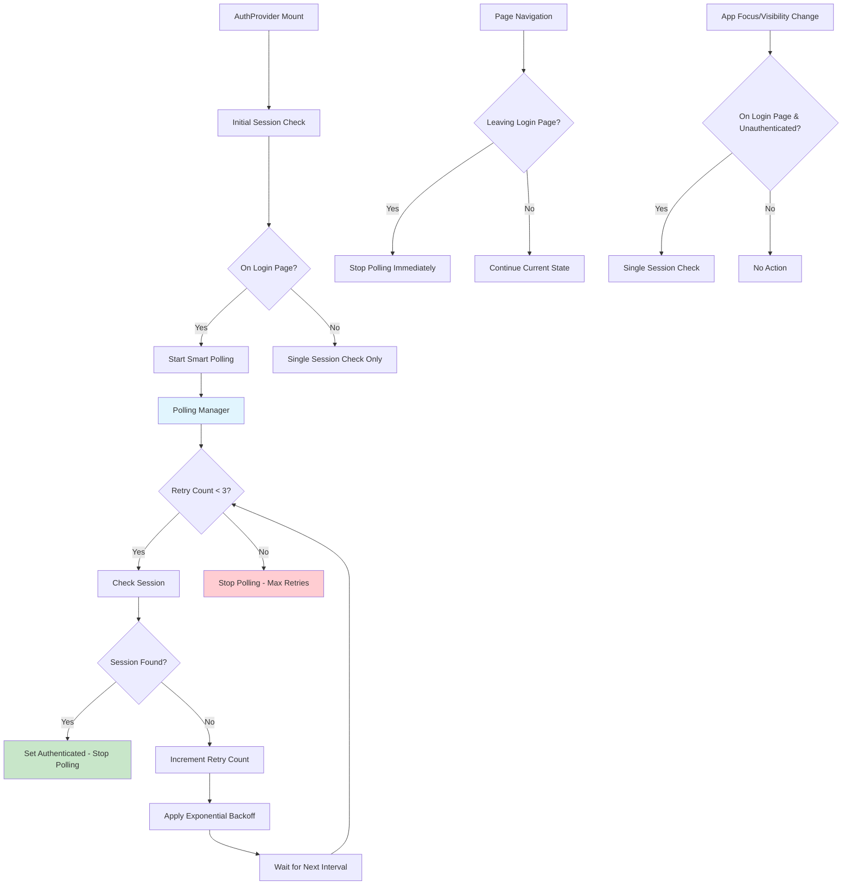

# Design Document

## Overview

This design document outlines the solution to fix the infinite loop issue in AuthContext's session polling mechanism. The current implementation continuously polls for sessions when unauthenticated, causing performance degradation and excessive logging. The solution implements intelligent session polling with retry limits, exponential backoff, and context-aware polling strategies.

## Architecture

### Current Problem Analysis

The infinite loop occurs in the `useEffect` hook of AuthProvider:

```typescript
// Current problematic code
pollingInterval = setInterval(() => {
  if (!isCheckingSession && authStatus === 'unauthenticated') {
    console.log('[AuthProvider] Polling for session...');
    setInitialSession(); // This creates infinite loop
  }
}, 1000);
```

**Root Causes:**
1. **Continuous Polling**: The interval runs indefinitely when `authStatus === 'unauthenticated'`
2. **No Retry Limits**: No mechanism to stop polling after failed attempts
3. **No Backoff Strategy**: Fixed 1-second interval regardless of failure count
4. **Context Insensitive**: Polls even when not on login page or when user is not expecting authentication

### Proposed Architecture



## Components and Interfaces

### 1. Smart Polling Manager

**Purpose**: Manages intelligent session polling with retry limits and backoff strategies

```typescript
interface PollingConfig {
  maxRetries: number;
  baseInterval: number; // milliseconds
  maxInterval: number; // milliseconds
  backoffMultiplier: number;
  enabledPaths: string[]; // Pages where polling is allowed
}

interface PollingState {
  isActive: boolean;
  retryCount: number;
  currentInterval: number;
  lastAttempt: Date | null;
  intervalId: NodeJS.Timeout | null;
}

class SessionPollingManager {
  private config: PollingConfig;
  private state: PollingState;
  private onSessionCheck: () => Promise<void>;
  
  constructor(config: PollingConfig, onSessionCheck: () => Promise<void>);
  
  start(): void;
  stop(): void;
  reset(): void;
  shouldPoll(currentPath: string, authStatus: AuthStatus): boolean;
  private scheduleNext(): void;
  private calculateNextInterval(): number;
}
```

### 2. Enhanced AuthProvider State Management

**Purpose**: Improved state management with polling control

```typescript
interface AuthProviderState {
  // Existing state
  user: User | null;
  userProfile: UserProfile | null;
  authStatus: AuthStatus;
  error: AuthError | null;
  lastUpdated: Date | null;
  
  // New polling control state
  isCheckingSession: boolean;
  pollingManager: SessionPollingManager | null;
  sessionCheckCount: number;
  lastSessionCheckTime: Date | null;
}

interface SessionCheckOptions {
  force?: boolean; // Force check even if recently checked
  source?: 'initial' | 'polling' | 'focus' | 'manual'; // Track check source for debugging
  maxRetries?: number; // Override default retry limit
}
```

### 3. Context-Aware Session Checking

**Purpose**: Intelligent session checking based on application context

```typescript
interface SessionCheckContext {
  currentPath: string;
  isLoginPage: boolean;
  isVisible: boolean;
  hasFocus: boolean;
  timeSinceLastCheck: number;
}

interface SessionCheckStrategy {
  shouldCheck(context: SessionCheckContext, authStatus: AuthStatus): boolean;
  getCheckInterval(context: SessionCheckContext, retryCount: number): number;
  shouldStartPolling(context: SessionCheckContext, authStatus: AuthStatus): boolean;
}
```

## Data Models

### Polling Configuration Model

```typescript
const DEFAULT_POLLING_CONFIG: PollingConfig = {
  maxRetries: 3,
  baseInterval: 2000, // Start with 2 seconds (more reasonable than 1 second)
  maxInterval: 30000, // Cap at 30 seconds
  backoffMultiplier: 2, // Double the interval each time
  enabledPaths: ['/login', '/auth/callback'] // Only poll on these pages
};

// Exponential backoff intervals: 2s, 4s, 8s, then stop
// This prevents infinite polling while still being responsive for magic links
```

### Session Check Tracking Model

```typescript
interface SessionCheckMetrics {
  totalChecks: number;
  successfulChecks: number;
  failedChecks: number;
  averageResponseTime: number;
  lastSuccessTime: Date | null;
  lastFailureTime: Date | null;
  consecutiveFailures: number;
}
```

## Error Handling

### Error Categories and Recovery Strategies

```typescript
interface SessionErrorStrategy {
  type: 'network' | 'session' | 'permission' | 'unknown';
  shouldRetry: boolean;
  retryDelay: number;
  maxRetries: number;
  fallbackAction: () => void;
}

const SESSION_ERROR_STRATEGIES: Record<string, SessionErrorStrategy> = {
  'AuthSessionMissingError': {
    type: 'session',
    shouldRetry: true,
    retryDelay: 2000,
    maxRetries: 2, // Limited retries for missing session
    fallbackAction: () => console.log('[Auth] Session missing, stopping polling')
  },
  'NetworkError': {
    type: 'network',
    shouldRetry: true,
    retryDelay: 5000,
    maxRetries: 3,
    fallbackAction: () => console.log('[Auth] Network error, will retry with backoff')
  },
  'AuthInvalidTokenError': {
    type: 'session',
    shouldRetry: false,
    retryDelay: 0,
    maxRetries: 0,
    fallbackAction: () => console.log('[Auth] Invalid token, clearing session')
  }
};
```

### Graceful Degradation

```typescript
interface GracefulDegradationStrategy {
  onMaxRetriesReached: () => void;
  onNetworkFailure: () => void;
  onSessionCorruption: () => void;
  onUnknownError: () => void;
}

const degradationStrategy: GracefulDegradationStrategy = {
  onMaxRetriesReached: () => {
    // Stop polling, show manual refresh option
    console.log('[Auth] Max retries reached, stopping automatic checks');
    // Could show a "Refresh" button to user
  },
  onNetworkFailure: () => {
    // Show network error message, allow manual retry
    console.log('[Auth] Network failure detected');
  },
  onSessionCorruption: () => {
    // Clear corrupted session data, redirect to login
    console.log('[Auth] Session corruption detected, clearing data');
  },
  onUnknownError: () => {
    // Log error, continue with reduced functionality
    console.log('[Auth] Unknown error, continuing with limited functionality');
  }
};
```

## Testing Strategy

### Unit Tests

1. **SessionPollingManager Tests**
   - Test polling start/stop functionality
   - Verify exponential backoff calculation
   - Test retry limit enforcement
   - Validate context-aware polling decisions

2. **AuthProvider State Management Tests**
   - Test state transitions during polling
   - Verify proper cleanup on unmount
   - Test error state handling
   - Validate memory leak prevention

3. **Session Check Logic Tests**
   - Test different session check scenarios
   - Verify proper error categorization
   - Test retry logic with various error types
   - Validate performance metrics tracking

### Integration Tests

1. **Magic Link Flow Tests**
   - Test magic link detection within 2 seconds
   - Verify polling stops after successful authentication
   - Test polling behavior on different pages
   - Validate app focus/visibility handling

2. **Error Recovery Tests**
   - Test network error recovery
   - Verify session corruption handling
   - Test max retry scenarios
   - Validate graceful degradation

3. **Performance Tests**
   - Measure polling impact on performance
   - Test memory usage over time
   - Verify proper cleanup of intervals/listeners
   - Test console logging reduction

### Load Tests

1. **Polling Efficiency Tests**
   - Test polling behavior with multiple tabs
   - Verify resource usage under continuous polling
   - Test cleanup when switching between pages
   - Validate performance with slow network conditions

## Implementation Strategy

### Phase 1: Core Polling Manager
- Implement SessionPollingManager class
- Add exponential backoff logic
- Implement retry limits and context awareness
- Add comprehensive error handling

### Phase 2: AuthProvider Integration
- Integrate polling manager into AuthProvider
- Update session check logic with new options
- Implement context-aware polling decisions
- Add performance metrics tracking

### Phase 3: Error Handling Enhancement
- Implement error categorization and strategies
- Add graceful degradation mechanisms
- Improve error logging and debugging
- Add user-facing error recovery options

### Phase 4: Testing and Optimization
- Comprehensive testing of all scenarios
- Performance optimization and memory leak prevention
- Documentation and debugging improvements
- Final validation and cleanup

## Performance Considerations

### Memory Management
- Proper cleanup of intervals and event listeners
- Avoid memory leaks in polling manager
- Efficient state management to prevent unnecessary re-renders

### Network Efficiency
- Intelligent polling intervals to reduce network requests
- Proper error handling to avoid unnecessary retries
- Context-aware polling to minimize background requests

### User Experience
- Responsive authentication detection for magic links
- Minimal impact on application performance
- Clear error messages and recovery options

## Backward Compatibility

### Maintained Functionality
- All existing authentication flows continue to work
- Magic link authentication remains functional
- PWA support is preserved and improved
- Existing error handling is enhanced, not replaced

### Migration Strategy
- Gradual rollout of new polling logic
- Fallback to existing behavior if new system fails
- Comprehensive testing before full deployment
- Monitoring and rollback capabilities