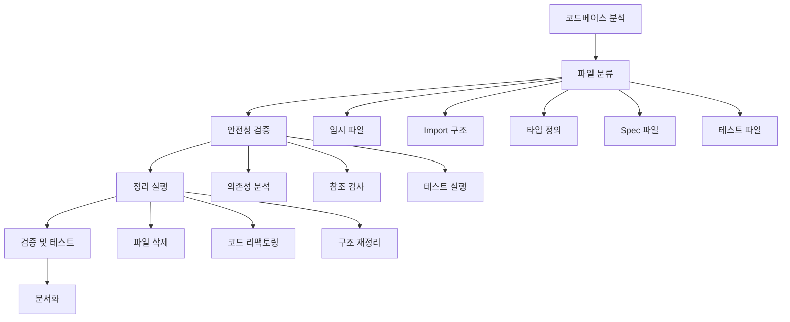

# Design Document

## Overview

RoomBook 프로젝트의 코드 아키텍처 정리는 현재 시스템의 안정성을 유지하면서 코드베이스를 체계적으로 정리하는 작업입니다. 분석 결과, 다음과 같은 주요 정리 영역이 식별되었습니다:

1. **임시 파일 및 백업 파일 정리**: `.tmp` 파일들과 사용되지 않는 백업 파일들
2. **Import 구조 표준화**: 상대 경로와 절대 경로 import의 일관성 확보
3. **타입 정의 최적화**: 중복된 타입 정의 통합 및 브랜드 타입 활용 개선
4. **사용되지 않는 spec 파일 정리**: 현재 코드베이스와 맞지 않는 오래된 spec 파일들
5. **테스트 파일 구조 정리**: 테스트 파일들의 일관된 구조 확립

## Architecture

### 정리 작업 아키텍처



### 안전성 보장 메커니즘

1. **백업 생성**: 모든 변경 전 자동 백업
2. **점진적 적용**: 단계별 변경으로 위험 최소화
3. **테스트 기반 검증**: 각 단계마다 테스트 실행
4. **롤백 지원**: 문제 발생 시 즉시 복구 가능

## Components and Interfaces

### 1. 파일 분석 컴포넌트

```typescript
interface FileAnalyzer {
  scanTemporaryFiles(): TemporaryFile[];
  analyzeImportStructure(): ImportAnalysis;
  findDuplicateTypes(): TypeDuplication[];
  identifyUnusedSpecs(): UnusedSpec[];
  validateTestStructure(): TestStructureIssue[];
}

interface TemporaryFile {
  path: string;
  type: 'tmp' | 'backup' | 'old';
  size: number;
  lastModified: Date;
  canSafelyDelete: boolean;
  references: string[];
}

interface ImportAnalysis {
  relativeImports: ImportInfo[];
  absoluteImports: ImportInfo[];
  inconsistencies: ImportInconsistency[];
  suggestions: ImportSuggestion[];
}

interface TypeDuplication {
  typeName: string;
  locations: string[];
  canMerge: boolean;
  mergeStrategy: 'union' | 'intersection' | 'replace';
}
```

### 2. 안전성 검증 컴포넌트

```typescript
interface SafetyValidator {
  checkDependencies(filePath: string): DependencyCheck;
  validateReferences(filePath: string): ReferenceCheck;
  runTests(scope?: string): TestResult;
  createBackup(files: string[]): BackupInfo;
}

interface DependencyCheck {
  isReferenced: boolean;
  referencedBy: string[];
  canSafelyRemove: boolean;
  warnings: string[];
}

interface ReferenceCheck {
  hasValidReferences: boolean;
  brokenReferences: string[];
  circularDependencies: string[];
}
```

### 3. 정리 실행 컴포넌트

```typescript
interface CleanupExecutor {
  removeTemporaryFiles(files: TemporaryFile[]): CleanupResult;
  standardizeImports(analysis: ImportAnalysis): RefactorResult;
  mergeTypes(duplications: TypeDuplication[]): TypeMergeResult;
  cleanupSpecs(unusedSpecs: UnusedSpec[]): SpecCleanupResult;
  reorganizeTests(issues: TestStructureIssue[]): TestReorganizeResult;
}

interface CleanupResult {
  success: boolean;
  filesRemoved: string[];
  errors: string[];
  warnings: string[];
  backupId: string;
}
```

## Data Models

### 정리 작업 상태 모델

```typescript
interface CleanupSession {
  id: string;
  startTime: Date;
  endTime?: Date;
  status: 'in_progress' | 'completed' | 'failed' | 'rolled_back';
  phases: CleanupPhase[];
  backups: BackupInfo[];
  summary: CleanupSummary;
}

interface CleanupPhase {
  name: string;
  status: 'pending' | 'in_progress' | 'completed' | 'failed';
  startTime?: Date;
  endTime?: Date;
  results: any;
  errors: string[];
}

interface BackupInfo {
  id: string;
  timestamp: Date;
  files: string[];
  size: number;
  location: string;
  canRestore: boolean;
}
```

### 파일 분류 모델

```typescript
interface FileClassification {
  temporaryFiles: {
    safe: TemporaryFile[];
    risky: TemporaryFile[];
    unknown: TemporaryFile[];
  };
  importIssues: {
    inconsistent: ImportInconsistency[];
    unused: UnusedImport[];
    circular: CircularImport[];
  };
  typeIssues: {
    duplicates: TypeDuplication[];
    unused: UnusedType[];
    inconsistent: InconsistentType[];
  };
  specFiles: {
    outdated: OutdatedSpec[];
    unused: UnusedSpec[];
    conflicting: ConflictingSpec[];
  };
}
```

## Error Handling

### 에러 분류 및 처리 전략

```typescript
enum CleanupErrorType {
  DEPENDENCY_VIOLATION = 'dependency_violation',
  REFERENCE_BROKEN = 'reference_broken',
  TEST_FAILURE = 'test_failure',
  BACKUP_FAILED = 'backup_failed',
  PERMISSION_DENIED = 'permission_denied',
  UNEXPECTED_ERROR = 'unexpected_error'
}

interface CleanupError {
  type: CleanupErrorType;
  message: string;
  file?: string;
  phase: string;
  recoverable: boolean;
  suggestion?: string;
}

class CleanupErrorHandler {
  handleError(error: CleanupError): ErrorHandlingResult {
    switch (error.type) {
      case CleanupErrorType.DEPENDENCY_VIOLATION:
        return this.handleDependencyViolation(error);
      case CleanupErrorType.TEST_FAILURE:
        return this.handleTestFailure(error);
      default:
        return this.handleGenericError(error);
    }
  }
}
```

### 롤백 메커니즘

```typescript
interface RollbackManager {
  createCheckpoint(phase: string): CheckpointInfo;
  rollbackToCheckpoint(checkpointId: string): RollbackResult;
  listCheckpoints(): CheckpointInfo[];
  cleanupCheckpoints(olderThan: Date): void;
}

interface CheckpointInfo {
  id: string;
  phase: string;
  timestamp: Date;
  files: string[];
  canRestore: boolean;
}
```

## Testing Strategy

### 테스트 단계별 전략

1. **사전 테스트**: 정리 작업 전 전체 테스트 스위트 실행
2. **단계별 테스트**: 각 정리 단계 후 관련 테스트 실행
3. **통합 테스트**: 전체 정리 완료 후 통합 테스트 실행
4. **회귀 테스트**: 기존 기능 정상 작동 확인

### 테스트 자동화

```typescript
interface TestAutomation {
  runPreCleanupTests(): TestResult;
  runPhaseTests(phase: string): TestResult;
  runPostCleanupTests(): TestResult;
  runRegressionTests(): TestResult;
  generateTestReport(): TestReport;
}

interface TestResult {
  passed: number;
  failed: number;
  skipped: number;
  duration: number;
  failures: TestFailure[];
  coverage?: CoverageInfo;
}
```

## Implementation Phases

### Phase 1: 분석 및 계획
- 전체 코드베이스 스캔
- 정리 대상 파일 식별
- 의존성 분석
- 안전성 평가

### Phase 2: 임시 파일 정리
- `.tmp` 파일 제거
- 사용되지 않는 백업 파일 정리
- 테스트 실행으로 안전성 확인

### Phase 3: Import 구조 표준화
- 상대/절대 경로 import 일관성 확보
- 사용되지 않는 import 제거
- Import 순서 표준화

### Phase 4: 타입 정의 최적화
- 중복 타입 통합
- 브랜드 타입 활용 개선
- 타입 파일 구조 정리

### Phase 5: Spec 파일 정리
- 오래된 spec 파일 식별
- 현재 코드와 일치하지 않는 spec 제거
- 유용한 spec 파일 보존

### Phase 6: 최종 검증 및 문서화
- 전체 테스트 실행
- 성능 검증
- 정리 결과 문서화

## Security Considerations

### 데이터 보안
- 백업 파일의 안전한 저장
- 민감한 정보가 포함된 파일 특별 처리
- 정리 과정에서 데이터 유출 방지

### 접근 제어
- 정리 작업 권한 관리
- 중요 파일 보호
- 감사 로그 생성

## Performance Considerations

### 최적화 전략
- 대용량 파일 처리 최적화
- 병렬 처리를 통한 성능 향상
- 메모리 사용량 모니터링

### 모니터링
- 정리 작업 진행 상황 추적
- 시스템 리소스 사용량 모니터링
- 성능 메트릭 수집

## Monitoring and Logging

### 로깅 전략
```typescript
interface CleanupLogger {
  logPhaseStart(phase: string): void;
  logPhaseComplete(phase: string, result: any): void;
  logError(error: CleanupError): void;
  logWarning(message: string, context?: any): void;
  generateReport(): CleanupReport;
}
```

### 모니터링 대시보드
- 실시간 진행 상황
- 에러 및 경고 알림
- 성능 메트릭 시각화
- 롤백 상태 모니터링