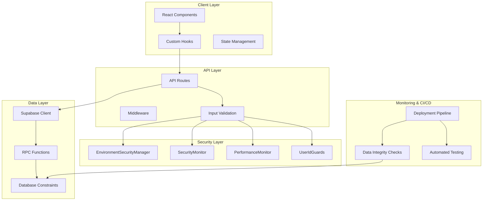
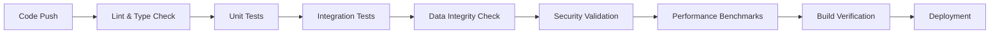

# Design Document

## Overview

This design document outlines a comprehensive refactoring and optimization strategy for a Next.js application with Supabase backend. The system already demonstrates excellent architecture with robust security monitoring (`SecurityMonitor`, `EnvironmentSecurityManager`), performance tracking (`PerformanceMonitor`), data integrity validation (`UserIdGuards`), and comprehensive error handling (`ReservationErrorHandler`). 

The refactoring focuses on systematically strengthening these existing foundations rather than rebuilding, with emphasis on preventing data integrity issues at the source, standardizing security patterns across all components, optimizing performance through consistent patterns, and automating deployment safety checks.

## Architecture

### Current Architecture Strengths
- **Security Layer**: Centralized environment variable management, comprehensive security event monitoring, and performance tracking
- **Data Integrity**: Type guards and validation functions for user ID consistency
- **Error Handling**: Structured error handling with `ReservationErrorHandler`
- **Validation**: Zod schemas for API input validation
- **Testing**: Comprehensive test coverage with Jest

### Enhanced Architecture Components



## Components and Interfaces

### 1. Enhanced Data Integrity System

#### Type System Strengthening
```typescript
// Enhanced type definitions
type AuthId = string & { readonly __brand: 'AuthId' };
type DatabaseUserId = string & { readonly __brand: 'DatabaseUserId' };

interface UserIdValidationContext {
  operation: 'create' | 'update' | 'delete' | 'query';
  table: string;
  userId: unknown;
  authContext?: AuthContext;
}
```

#### Database Constraint Integration
- Extend existing database triggers and constraints
- Add foreign key constraints with proper cascade rules
- Implement check constraints for UUID format validation
- Create audit triggers for data modification tracking

### 2. Standardized Security Integration

#### Environment Variable Access Pattern
```typescript
// Mandatory pattern for all environment access
class SecureEnvironmentAccess {
  static getVariable(key: string, context: AccessContext): string {
    return environmentManager.getSecureVariable(key, context);
  }
}
```

#### Security Event Integration Points
- Authentication flows (login, logout, session validation)
- Authorization checks (admin access, resource permissions)
- Data modification operations (create, update, delete)
- API rate limiting and abuse detection

### 3. Performance Optimization Framework

#### Supabase RPC Function Pattern
```typescript
// Standardized RPC function interface
interface OptimizedDataQuery<T> {
  functionName: string;
  parameters: Record<string, any>;
  cacheConfig: CacheConfiguration;
  retryConfig: RetryConfiguration;
}
```

#### Data Fetching Hook Standardization
- Consistent cache strategies (staleTime, gcTime)
- Unified retry logic with exponential backoff
- Error boundary integration
- Loading state management

### 4. API Standardization Layer

#### Input Validation Middleware
```typescript
// Mandatory validation wrapper for all API routes
export function withValidation<T>(
  schema: z.ZodSchema<T>,
  handler: (req: NextRequest, validatedData: T) => Promise<Response>
) {
  return async (req: NextRequest) => {
    // Validation, security checks, and error handling
  };
}
```

#### Pagination Interface
```typescript
interface PaginatedRequest {
  limit?: number;
  offset?: number;
  sortBy?: string;
  sortOrder?: 'asc' | 'desc';
}

interface PaginatedResponse<T> {
  data: T[];
  pagination: {
    total: number;
    limit: number;
    offset: number;
    hasMore: boolean;
  };
}
```

## Data Models

### Enhanced User Identity Model
```typescript
interface EnhancedUserIdentity {
  databaseId: DatabaseUserId;
  authId: AuthId;
  email: string;
  profile: UserProfile;
  securityContext: SecurityContext;
  lastValidated: Date;
}
```

### Security Event Model
```typescript
interface SecurityEventContext {
  eventType: SecurityEventType;
  severity: SecuritySeverity;
  userId?: DatabaseUserId;
  sessionId?: string;
  ipAddress?: string;
  userAgent?: string;
  endpoint?: string;
  metadata: Record<string, any>;
}
```

### Performance Metric Model
```typescript
interface PerformanceMetricContext {
  operation: PerformanceOperation;
  duration: number;
  success: boolean;
  resourceUsage?: ResourceUsage;
  metadata: Record<string, any>;
}
```

## Error Handling

### Centralized Error Processing
- Extend `ReservationErrorHandler` pattern to all API endpoints
- Implement structured error logging with security context
- Add error correlation IDs for debugging
- Create user-friendly error message mapping

### Error Recovery Strategies
```typescript
interface ErrorRecoveryStrategy {
  errorType: string;
  retryable: boolean;
  maxRetries: number;
  backoffStrategy: 'linear' | 'exponential';
  fallbackAction?: () => Promise<any>;
}
```

## Testing Strategy

### Enhanced Test Coverage Areas

#### 1. Data Integrity Testing
- User ID validation across all operations
- Database constraint violation scenarios
- Type guard effectiveness testing
- Cross-table referential integrity

#### 2. Security Integration Testing
- Environment variable access patterns
- Security event generation and handling
- Performance monitoring accuracy
- Alert threshold validation

#### 3. API Standardization Testing
- Input validation consistency
- Error handling uniformity
- Pagination functionality
- Rate limiting effectiveness

#### 4. Performance Testing
- RPC function optimization verification
- Cache strategy effectiveness
- Hook performance consistency
- Database query optimization

### Automated Testing Pipeline


## Implementation Phases

### Phase 1: Foundation Strengthening
- Enhance type system with branded types
- Standardize environment variable access
- Implement mandatory input validation
- Extend database constraints

### Phase 2: Security Integration
- Apply security monitoring to all critical paths
- Implement performance tracking consistently
- Add comprehensive audit logging
- Create alert notification system

### Phase 3: Performance Optimization
- Convert complex queries to RPC functions
- Standardize data fetching patterns
- Implement consistent caching strategies
- Add pagination to all list endpoints

### Phase 4: Automation & Monitoring
- Build CI/CD pipeline with safety checks
- Implement automated data integrity validation
- Add continuous performance monitoring
- Create deployment rollback mechanisms

## Deployment Strategy

### Pre-deployment Validation
1. **Code Quality Gates**: Linting, type checking, test coverage
2. **Data Integrity Verification**: Run consistency check scripts
3. **Security Validation**: Environment variable verification
4. **Performance Benchmarking**: Ensure no regression in key metrics

### Deployment Pipeline
```yaml
# Example GitHub Actions workflow structure
stages:
  - validate_code
  - run_tests
  - check_data_integrity
  - verify_security
  - build_application
  - deploy_staging
  - run_e2e_tests
  - deploy_production
  - post_deployment_monitoring
```

### Post-deployment Monitoring
- Automated daily data integrity checks
- Continuous security event monitoring
- Performance metric tracking
- Alert notification system for anomalies

## Risk Mitigation

### Data Integrity Risks
- **Mitigation**: Database constraints + type guards + automated validation
- **Monitoring**: Daily consistency check scripts
- **Recovery**: Automated repair scripts with manual approval

### Security Risks
- **Mitigation**: Centralized access control + comprehensive monitoring
- **Detection**: Real-time security event analysis
- **Response**: Automated alert system with escalation procedures

### Performance Risks
- **Prevention**: Consistent optimization patterns + performance testing
- **Monitoring**: Continuous performance metric collection
- **Optimization**: Automated performance regression detection