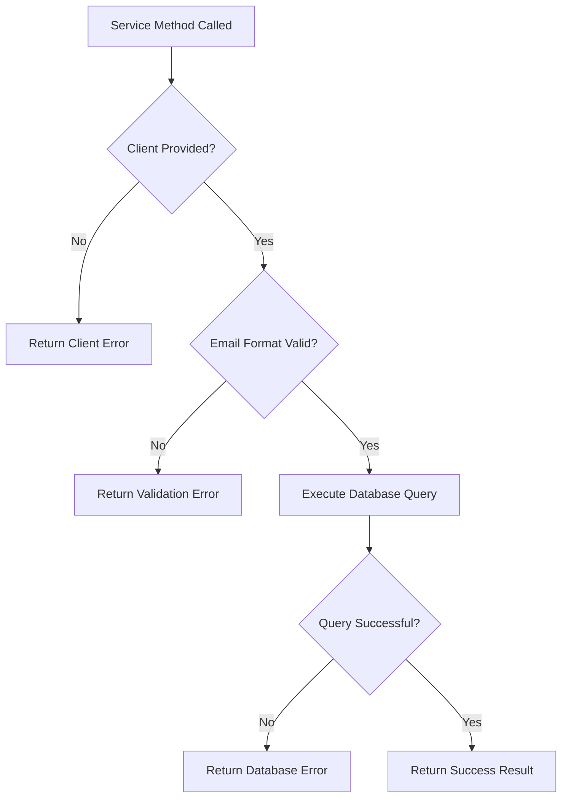

# Design Document

## Overview

This design document outlines the refactoring of utility services to use dependency injection pattern, specifically focusing on the `EmailValidationService` and similar hybrid utilities. The goal is to eliminate architectural violations where services attempt to create Supabase clients internally or use React hooks inappropriately, while maintaining all existing functionality and error handling.

## Architecture

### Current Architecture Issues

1. **Hook Usage Violation**: The current `EmailValidationService` attempts to use `useSupabaseClient` hook inside a service class, which violates React's rules of hooks
2. **Environment Coupling**: Services are tightly coupled to specific environments (server/client) through direct client creation
3. **Testing Difficulties**: Hard-coded client creation makes unit testing and mocking challenging
4. **Inconsistent Patterns**: Some services use dependency injection while others create clients internally

### Target Architecture

The new architecture will follow these principles:

1. **Pure Service Functions**: All service methods will be pure functions that receive dependencies as parameters
2. **Environment Agnostic**: Services will work identically in server and client environments
3. **Dependency Injection**: All external dependencies (Supabase clients, configuration) will be injected
4. **Consistent Error Handling**: Maintain existing error handling patterns while adding client validation

## Components and Interfaces

### 1. Refactored EmailValidationService

```typescript
// New interface with dependency injection
export interface EmailValidationService {
  checkEmailExists(supabase: SupabaseClient<Database>, email: string): Promise<EmailCheckResult>;
  validateEmailFormat(email: string): boolean;
  getValidationError(): string | null;
}

// Updated service class
class EnhancedEmailValidationService implements EmailValidationService {
  // Remove all client creation logic
  // Add client validation in methods
  async checkEmailExists(supabase: SupabaseClient<Database>, email: string): Promise<EmailCheckResult> {
    // Validate client parameter
    if (!supabase) {
      return {
        exists: false,
        error: {
          type: 'client_not_ready',
          message: 'Supabase client not provided',
          userMessage: '서비스 연결에 문제가 있습니다.',
          canRetry: false
        }
      };
    }
    
    // Rest of existing logic remains the same
  }
}
```

### 2. Updated Function Exports

```typescript
// Updated function signatures
export async function checkEmailExists(
  supabase: SupabaseClient<Database>, 
  email: string
): Promise<EmailCheckResult> {
  return emailValidationService.checkEmailExists(supabase, email);
}
```

### 3. Client Creation Patterns

#### Server-side Usage (API Routes)
```typescript
import { createClient } from '@/lib/supabase/server';
import { checkEmailExists } from '@/lib/email-validation/email-validation-service';

export async function POST(request: Request) {
  const supabase = createClient(); // Server client
  const { email } = await request.json();
  const result = await checkEmailExists(supabase, email);
  return NextResponse.json(result);
}
```

#### Client-side Usage (React Components)
```typescript
import { useSupabaseClient } from '@/contexts/SupabaseProvider';
import { checkEmailExists } from '@/lib/email-validation/email-validation-service';

export function SignupForm() {
  const supabase = useSupabaseClient();
  
  const handleEmailCheck = async (email: string) => {
    if (!supabase) return; // Guard clause
    const result = await checkEmailExists(supabase, email);
    // Handle result
  };
}
```

## Data Models

### EmailCheckResult Interface
The existing `EmailCheckResult` interface will remain unchanged to maintain backward compatibility:

```typescript
export interface EmailCheckResult {
  exists: boolean;
  error?: {
    type: 'client_not_ready' | 'network_error' | 'database_error' | 'validation_error';
    message: string;
    userMessage: string;
    canRetry: boolean;
    technicalDetails?: string;
  };
}
```

### New Client Validation Error Type
A new error type will be added to handle null/undefined client parameters:

```typescript
// Added to existing error types
type ErrorType = 'client_not_ready' | 'network_error' | 'database_error' | 'validation_error';
```

## Error Handling

### Client Validation Strategy

1. **Null Client Handling**: When a null or undefined client is passed, return a structured error response instead of throwing
2. **Error Message Consistency**: Maintain existing Korean user messages for consistency
3. **Retry Logic**: Client validation errors should not be retryable since they indicate programming errors

### Error Flow Diagram



### Backward Compatibility

1. **Same Return Types**: All methods will return the same types as before
2. **Same Error Messages**: User-facing error messages will remain identical
3. **Same Behavior**: Retry logic, validation rules, and error categorization will be preserved

## Testing Strategy

### Unit Testing Improvements

1. **Mock Injection**: Supabase clients can be easily mocked and injected for testing
2. **Error Scenario Testing**: Client validation errors can be tested by passing null clients
3. **Isolated Testing**: Services can be tested without any Supabase setup

### Test Structure

```typescript
describe('EmailValidationService with Dependency Injection', () => {
  let mockSupabase: jest.Mocked<SupabaseClient<Database>>;
  
  beforeEach(() => {
    mockSupabase = createMockSupabaseClient();
  });
  
  it('should handle null client gracefully', async () => {
    const result = await checkEmailExists(null as any, 'test@example.com');
    expect(result.error?.type).toBe('client_not_ready');
  });
  
  it('should work with mocked client', async () => {
    mockSupabase.rpc.mockResolvedValue({ data: false, error: null });
    const result = await checkEmailExists(mockSupabase, 'test@example.com');
    expect(result.exists).toBe(false);
  });
});
```

### Integration Testing

1. **Server Environment**: Test with server-created clients in API route tests
2. **Client Environment**: Test with browser clients in component tests
3. **Cross-Environment**: Ensure same service works in both environments

## Implementation Phases

### Phase 1: Service Refactoring
1. Update `EmailValidationService` class methods to accept client parameters
2. Add client validation logic
3. Remove all internal client creation code
4. Update function exports to match new signatures

### Phase 2: Caller Updates
1. Identify all callers of the email validation service
2. Update API routes to create server clients and pass them
3. Update React components to use client context and pass clients
4. Update tests to use dependency injection pattern

### Phase 3: Validation and Cleanup
1. Run comprehensive tests to ensure functionality is preserved
2. Update TypeScript types and interfaces
3. Clean up unused imports and dependencies
4. Verify build process produces no warnings

## Migration Strategy

### Backward Compatibility Approach

To ensure zero downtime and gradual migration:

1. **Dual Interface Support**: Temporarily support both old and new method signatures
2. **Deprecation Warnings**: Add console warnings for old usage patterns
3. **Gradual Migration**: Update callers one by one
4. **Final Cleanup**: Remove deprecated interfaces after all callers are updated

### Risk Mitigation

1. **Comprehensive Testing**: Extensive test coverage before and after refactoring
2. **Feature Flags**: Use feature flags to control rollout if needed
3. **Rollback Plan**: Keep original implementation available for quick rollback
4. **Monitoring**: Monitor error rates and user feedback during migration