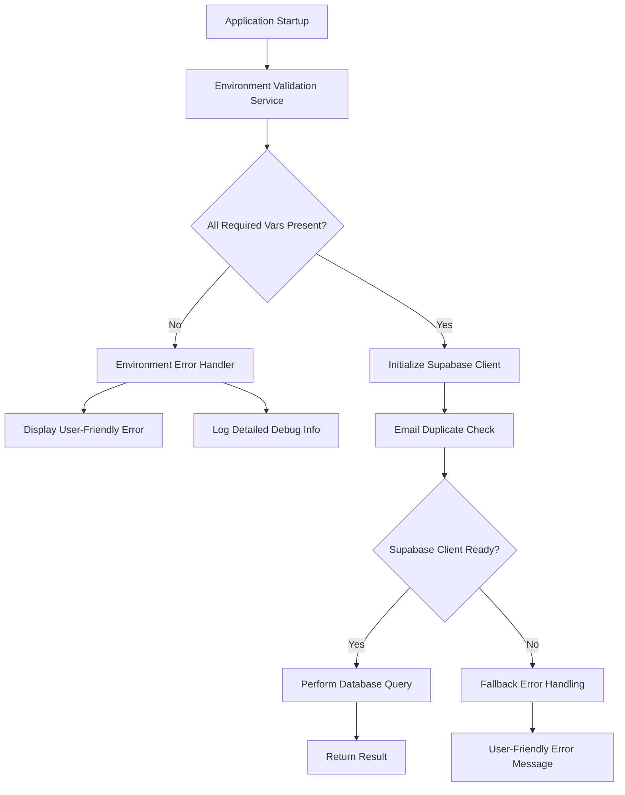

# Design Document

## Overview

This design addresses the critical environment variable configuration issue that prevents the Supabase client from initializing properly, specifically the "Required environment variable NEXT_PUBLIC_SUPABASE_URL is not set" error. The solution involves creating a robust environment configuration validation system, improving error handling, and ensuring proper fallback mechanisms for different deployment environments.

## Architecture

### Current Issue Analysis

The error occurs in the secure environment access system at `src/lib/security/secure-environment-access.ts:625:11`, which is called by the Supabase client initialization in `src/lib/supabase/client.ts:19:27`. The issue manifests during email duplicate checking in the signup process.

**Root Causes:**
1. Environment variables may not be properly loaded in test/deployment environments
2. The secure environment access system throws errors instead of providing graceful fallbacks
3. Missing environment-specific configuration validation
4. Lack of proper error handling in the Supabase client initialization chain

### Solution Architecture



## Components and Interfaces

### 1. Environment Configuration Validator

**Purpose:** Validate and manage environment variables across different deployment contexts

```typescript
interface EnvironmentValidationResult {
  isValid: boolean;
  missingVariables: string[];
  invalidVariables: { key: string; reason: string }[];
  environment: 'development' | 'test' | 'production';
  recommendations: string[];
}

interface EnvironmentConfigValidator {
  validateAtStartup(): Promise<EnvironmentValidationResult>;
  validateForEnvironment(env: string): Promise<EnvironmentValidationResult>;
  getEnvironmentSpecificConfig(env: string): EnvironmentConfig;
  generateTroubleshootingGuide(result: EnvironmentValidationResult): string;
}
```

### 2. Enhanced Supabase Client Manager

**Purpose:** Provide robust Supabase client initialization with proper error handling

```typescript
interface SupabaseClientManager {
  initializeClient(): Promise<SupabaseClient>;
  getClient(): Promise<SupabaseClient>;
  isClientReady(): boolean;
  getInitializationError(): Error | null;
  reinitializeClient(): Promise<SupabaseClient>;
}

interface ClientInitializationResult {
  success: boolean;
  client?: SupabaseClient;
  error?: {
    type: 'environment' | 'network' | 'configuration';
    message: string;
    troubleshooting: string[];
  };
}
```

### 3. Email Validation Service with Fallbacks

**Purpose:** Provide email duplicate checking with proper error handling and fallbacks

```typescript
interface EmailValidationService {
  checkEmailExists(email: string): Promise<EmailCheckResult>;
  validateEmailFormat(email: string): boolean;
  getValidationError(): string | null;
}

interface EmailCheckResult {
  exists: boolean;
  error?: {
    type: 'client_not_ready' | 'network_error' | 'database_error';
    message: string;
    userMessage: string;
    canRetry: boolean;
  };
}
```

### 4. Environment-Specific Error Handler

**Purpose:** Provide context-aware error messages and troubleshooting guidance

```typescript
interface EnvironmentErrorHandler {
  handleEnvironmentError(error: Error, context: ErrorContext): UserFriendlyError;
  generateTroubleshootingSteps(error: Error, environment: string): string[];
  shouldShowDetailedError(environment: string): boolean;
}

interface UserFriendlyError {
  title: string;
  message: string;
  actions: ErrorAction[];
  technicalDetails?: string;
}

interface ErrorAction {
  label: string;
  action: 'retry' | 'redirect' | 'contact_support';
  target?: string;
}
```

## Data Models

### Environment Configuration Schema

```typescript
interface EnvironmentConfig {
  required: {
    NEXT_PUBLIC_SUPABASE_URL: string;
    NEXT_PUBLIC_SUPABASE_ANON_KEY: string;
  };
  optional: {
    SUPABASE_SERVICE_ROLE_KEY?: string;
    NODE_ENV?: string;
    NEXTAUTH_SECRET?: string;
  };
  validation: {
    [key: string]: (value: string) => ValidationResult;
  };
}

interface ValidationResult {
  isValid: boolean;
  error?: string;
  suggestions?: string[];
}
```

### Error Context Schema

```typescript
interface ErrorContext {
  operation: 'startup' | 'email_check' | 'client_init';
  environment: string;
  userAgent?: string;
  timestamp: Date;
  userId?: string;
  sessionId?: string;
  previousErrors?: Error[];
}
```

## Error Handling

### 1. Startup Environment Validation

- **Early Detection:** Validate all required environment variables before application starts
- **Environment-Specific Checks:** Different validation rules for development, test, and production
- **Detailed Logging:** Log missing or invalid variables with specific guidance
- **Graceful Degradation:** Allow application to start with warnings for non-critical variables

### 2. Supabase Client Initialization Errors

- **Retry Logic:** Implement exponential backoff for transient failures
- **Fallback Mechanisms:** Provide offline-capable error states
- **User Communication:** Clear, actionable error messages for users
- **Developer Debugging:** Detailed technical information in development mode

### 3. Email Duplicate Check Error Handling

- **Client Not Ready:** Show "Please try again" message with retry button
- **Network Errors:** Indicate connectivity issues with retry option
- **Database Errors:** Generic error message with support contact information
- **Timeout Handling:** Cancel long-running requests and show timeout message

### 4. Environment-Specific Error Responses

**Development Environment:**
- Show detailed technical errors
- Include troubleshooting steps
- Display environment variable values (non-sensitive)
- Provide quick fix suggestions

**Test Environment:**
- Moderate detail level
- Focus on configuration issues
- Include deployment-specific guidance
- Log errors for CI/CD debugging

**Production Environment:**
- User-friendly messages only
- Hide technical details
- Provide support contact information
- Comprehensive error logging for administrators

## Testing Strategy

### 1. Environment Configuration Testing

```typescript
describe('Environment Configuration', () => {
  test('validates required variables in production');
  test('provides fallbacks for optional variables');
  test('generates appropriate error messages');
  test('handles missing .env files gracefully');
});
```

### 2. Supabase Client Initialization Testing

```typescript
describe('Supabase Client Manager', () => {
  test('initializes client with valid environment');
  test('handles missing environment variables');
  test('retries on transient failures');
  test('provides fallback error states');
});
```

### 3. Email Validation Service Testing

```typescript
describe('Email Validation Service', () => {
  test('checks email duplicates when client is ready');
  test('handles client initialization failures');
  test('provides user-friendly error messages');
  test('implements proper retry logic');
});
```

### 4. Integration Testing

```typescript
describe('Environment Error Integration', () => {
  test('end-to-end signup flow with missing environment variables');
  test('error recovery after environment fix');
  test('user experience during configuration issues');
  test('proper error logging and monitoring');
});
```

### 5. Environment-Specific Testing

- **Development:** Test with various missing/invalid environment configurations
- **Test Environment:** Simulate deployment-specific configuration issues
- **Production:** Test error handling without exposing sensitive information

## Implementation Considerations

### 1. Backward Compatibility

- Maintain existing API interfaces for `useAuth` hook
- Preserve current error handling behavior where appropriate
- Ensure existing components continue to work during transition

### 2. Performance Impact

- Minimize startup validation overhead
- Cache environment validation results
- Implement lazy loading for non-critical validations
- Optimize error handling paths to avoid performance degradation

### 3. Security Considerations

- Never expose sensitive environment variables in error messages
- Implement proper logging levels for different environments
- Ensure error messages don't leak system information
- Validate environment variable formats to prevent injection attacks

### 4. Deployment Strategy

- Implement feature flags for gradual rollout
- Provide migration path for existing deployments
- Include deployment verification scripts
- Create rollback procedures for configuration issues

### 5. Monitoring and Observability

- Track environment validation failures
- Monitor Supabase client initialization success rates
- Alert on repeated configuration errors
- Provide dashboards for deployment health monitoring