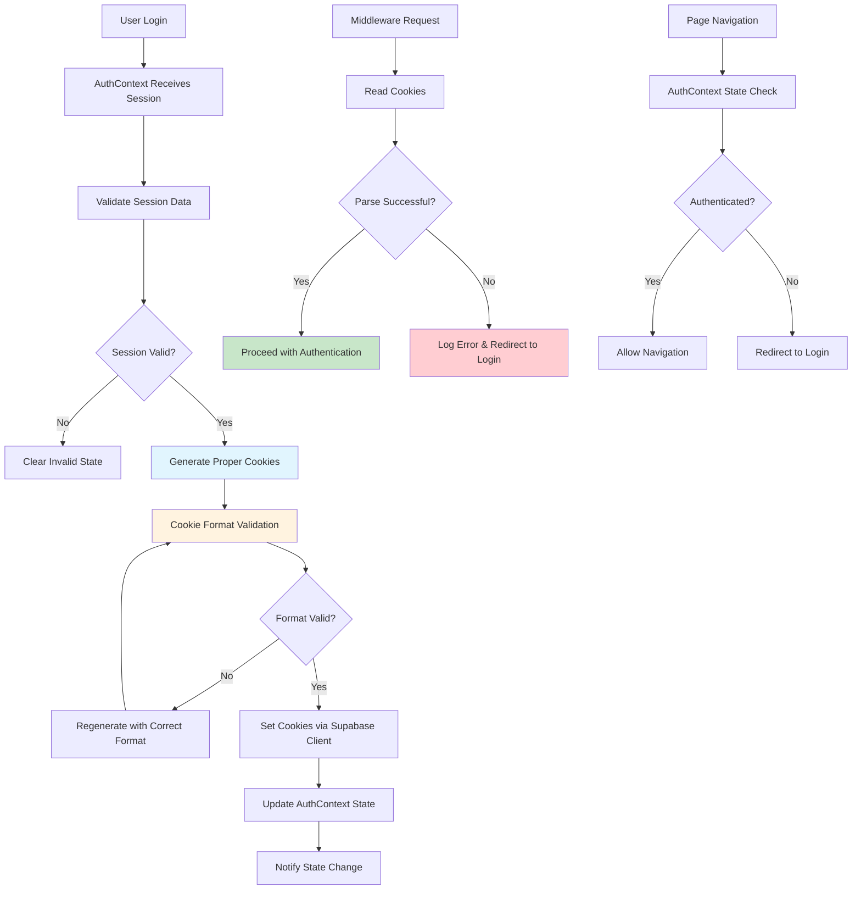

# Design Document

## Overview

This design document outlines the solution to fix the middleware cookie parsing issue by addressing the root cause: AuthContext not generating properly formatted session cookies compatible with server-side middleware parsing. The solution maintains strict architectural integrity by working within the established AuthContext authority and following official Supabase Next.js integration patterns.

## Architecture

### Current Problem Analysis

The "Failed to parse cookie string: SyntaxError: Unexpected token b in JSON at position 0" error indicates that AuthContext is generating malformed session cookies that cannot be parsed by the middleware. This violates the architectural principle that AuthContext must be the single source of truth for authentication state across both client and server contexts.

**Root Cause Identification:**

```typescript
// Current problematic flow
1. User logs in successfully → AuthContext receives session
2. AuthContext attempts to sync cookies → Malformed cookie generation
3. User navigates to protected route → Middleware reads malformed cookies
4. Middleware fails to parse cookies → Redirects to login
5. Login page detects existing auth → Redirects back → Infinite loop
```

**Architectural Violations:**
1. **Inconsistent Cookie Format**: AuthContext generates cookies in a format incompatible with middleware parsing
2. **Missing Validation**: No validation of cookie format before setting
3. **Improper Supabase Integration**: Not following official @supabase/auth-helpers-nextjs patterns
4. **State Synchronization Gap**: Client and server authentication states become desynchronized

### Proposed Architecture



## Components and Interfaces

### 1. Enhanced AuthContext Cookie Management

**Purpose**: Ensure AuthContext generates properly formatted cookies compatible with middleware parsing

```typescript
interface CookieValidationResult {
  isValid: boolean;
  error?: string;
  correctedValue?: string;
}

interface AuthCookieManager {
  validateCookieFormat(cookieValue: string): CookieValidationResult;
  generateValidCookie(sessionData: Session): string;
  setCookiesSafely(session: Session): Promise<boolean>;
  clearCorruptedCookies(): Promise<void>;
}

interface EnhancedAuthContextState {
  // Existing state
  user: User | null;
  userProfile: UserProfile | null;
  authStatus: AuthStatus;
  error: AuthError | null;
  lastUpdated: Date | null;
  
  // New cookie management state
  cookieManager: AuthCookieManager;
  cookieValidationEnabled: boolean;
  lastCookieValidation: Date | null;
  cookieGenerationAttempts: number;
}
```

### 2. Simplified Session Management

**Purpose**: Use Supabase auth-helpers correctly to ensure proper cookie handling

```typescript
interface SessionManagementOptions {
  forceRefresh?: boolean;
  validateSession?: boolean;
  clearOnError?: boolean;
}

interface AuthContextEnhancement {
  setSessionSafely(session: Session, options?: SessionManagementOptions): Promise<boolean>;
  clearInvalidSession(): Promise<void>;
  validateCurrentSession(): Promise<boolean>;
  handleAuthError(error: AuthError): Promise<void>;
}
```

## Data Models

### Cookie Format Specification

```typescript
// Expected cookie format for Supabase sessions
interface SupabaseSessionCookie {
  access_token: string;
  refresh_token: string;
  expires_at: number;
  expires_in: number;
  token_type: 'bearer';
  user: {
    id: string;
    email: string;
    // ... other user properties
  };
}

// Cookie validation patterns
const COOKIE_VALIDATION_PATTERNS = {
  JSON_START: /^[\{\[]/,
  VALID_JSON: /^[\{\[].*[\}\]]$/,
  BASE64_ENCODED: /^[A-Za-z0-9+/]*={0,2}$/,
  SUPABASE_TOKEN: /^sb-[a-zA-Z0-9]+-auth-token$/
};
```

### Error Classification

```typescript
interface CookieError {
  type: 'format' | 'parsing' | 'validation' | 'generation';
  severity: 'low' | 'medium' | 'high' | 'critical';
  message: string;
  originalValue?: string;
  suggestedFix?: string;
  canRecover: boolean;
}

const COOKIE_ERROR_STRATEGIES = {
  INVALID_JSON: {
    type: 'format',
    severity: 'high',
    canRecover: true,
    action: 'regenerate_cookie'
  },
  MISSING_TOKEN: {
    type: 'validation',
    severity: 'critical',
    canRecover: true,
    action: 'refresh_session'
  },
  CORRUPTED_DATA: {
    type: 'parsing',
    severity: 'high',
    canRecover: true,
    action: 'clear_and_reauth'
  }
};
```

## Implementation Strategy

### Phase 1: AuthContext Cookie Generation Fix

**Objective**: Fix the root cause by ensuring AuthContext generates properly formatted cookies

```typescript
// Enhanced setInitialSession method in AuthContext
const setInitialSession = async (options?: SessionCheckOptions) => {
  try {
    const { data: { session }, error } = await supabase.auth.getSession();
    
    if (error) {
      console.error('[AuthContext] Session retrieval error:', error);
      await cookieManager.clearCorruptedCookies();
      setAuthStatus('unauthenticated');
      return;
    }

    if (session) {
      // Use Supabase's built-in session management for proper cookie handling
      const sessionSetSuccess = await cookieManager.setCookiesSafely(session);
      
      if (!sessionSetSuccess) {
        console.warn('[AuthContext] Session setting failed, clearing and retrying...');
        await cookieManager.clearCorruptedCookies();
        
        // Attempt to refresh the session to get a clean state
        const { data: refreshData, error: refreshError } = await supabase.auth.refreshSession();
        
        if (refreshData.session && !refreshError) {
          const retrySuccess = await cookieManager.setCookiesSafely(refreshData.session);
          if (!retrySuccess) {
            console.error('[AuthContext] Session setting failed after refresh');
            setError({ message: 'Session initialization failed', type: 'session' });
            setAuthStatus('unauthenticated');
            return;
          }
          // Use the refreshed session
          setUser(refreshData.session.user);
        } else {
          console.error('[AuthContext] Session refresh failed:', refreshError);
          setError({ message: 'Session refresh failed', type: 'session' });
          setAuthStatus('unauthenticated');
          return;
        }
      } else {
        setUser(session.user);
      }

      setAuthStatus('authenticated');
      console.log('[AuthContext] Session established with valid cookies');
    } else {
      setUser(null);
      setAuthStatus('unauthenticated');
    }
  } catch (error) {
    console.error('[AuthContext] Session initialization error:', error);
    await cookieManager.clearCorruptedCookies();
    setAuthStatus('unauthenticated');
    setError({ message: 'Session initialization failed', type: 'session' });
  }
};
```

### Phase 2: Cookie Validation and Recovery

**Objective**: Implement robust cookie validation and recovery mechanisms

```typescript
class AuthCookieManager implements AuthCookieManager {
  validateCookieFormat(cookieValue: string): CookieValidationResult {
    try {
      // Check if it's valid JSON
      if (!COOKIE_VALIDATION_PATTERNS.JSON_START.test(cookieValue)) {
        return {
          isValid: false,
          error: 'Cookie does not start with valid JSON character',
          correctedValue: this.attemptCookieRecovery(cookieValue)
        };
      }

      // Attempt to parse as JSON
      const parsed = JSON.parse(cookieValue);
      
      // Validate required Supabase session fields
      if (!parsed.access_token || !parsed.user) {
        return {
          isValid: false,
          error: 'Missing required session fields',
        };
      }

      return { isValid: true };
    } catch (error) {
      return {
        isValid: false,
        error: `JSON parsing failed: ${error.message}`,
      };
    }
  }

  async setCookiesSafely(session: Session): Promise<boolean> {
    try {
      // Let Supabase handle cookie formatting and setting
      // This ensures compatibility with middleware parsing
      const { error } = await supabase.auth.setSession({
        access_token: session.access_token,
        refresh_token: session.refresh_token
      });

      if (error) {
        console.error('[AuthCookieManager] Supabase setSession failed:', error);
        return false;
      }

      // Verify the session was set correctly by reading it back
      const { data: verifySession, error: verifyError } = await supabase.auth.getSession();
      
      if (verifyError || !verifySession.session) {
        console.error('[AuthCookieManager] Session verification failed:', verifyError);
        return false;
      }

      console.log('[AuthCookieManager] Session set successfully with valid cookies');
      return true;
    } catch (error) {
      console.error('[AuthCookieManager] Cookie setting failed:', error);
      return false;
    }
  }
}
```

### Phase 3: Middleware Error Handling Enhancement

**Objective**: Improve middleware error handling while maintaining architectural boundaries

```typescript
// Enhanced middleware session handling
export async function middleware(request: NextRequest) {
  // ... existing code ...

  const response = NextResponse.next({
    request: { headers: request.headers },
  });

  const supabase = createMiddlewareClient({ req: request, res: response });

  let session: Session | null = null;
  let user: User | null = null;
  let sessionError: string | null = null;
  
  try {
    const sessionResult = await supabase.auth.getSession();
    session = sessionResult.data.session;
    user = session?.user || null;
    
    // Enhanced error logging for debugging
    if (!session && !sessionResult.error) {
      console.log('[Middleware] No session found, checking cookies...');
      
      // Log cookie information for debugging (without exposing sensitive data)
      const cookies = request.cookies.getAll();
      const authCookies = cookies.filter(cookie => 
        cookie.name.includes('supabase') || cookie.name.includes('sb-')
      );
      
      console.log('[Middleware] Auth cookies found:', authCookies.map(c => ({
        name: c.name,
        hasValue: !!c.value,
        valueLength: c.value?.length || 0,
        startsWithValidChar: c.value ? /^[\{\[]/.test(c.value) : false
      })));
    }
    
  } catch (error) {
    console.error('[Middleware] Session check failed:', {
      error: error.message,
      stack: error.stack,
      pathname,
      userAgent: request.headers.get('user-agent')
    });
    
    session = null;
    user = null;
    sessionError = error.message;
  }

  // ... rest of middleware logic ...
}
```

## Testing Strategy

### Unit Tests

1. **Cookie Generation Tests**
   - Test AuthContext generates valid JSON cookies
   - Verify cookie format validation works correctly
   - Test cookie recovery mechanisms
   - Validate error handling for malformed cookies

2. **Session State Management Tests**
   - Test session synchronization between client and server
   - Verify state consistency after cookie operations
   - Test error recovery flows
   - Validate cleanup mechanisms

### Integration Tests

1. **End-to-End Authentication Flow Tests**
   - Test complete login flow with cookie validation
   - Verify middleware can parse AuthContext-generated cookies
   - Test navigation between protected routes
   - Validate session persistence across page refreshes

2. **Error Recovery Tests**
   - Test recovery from corrupted cookies
   - Verify graceful handling of parsing errors
   - Test infinite loop prevention
   - Validate error logging and debugging information

### Performance Tests

1. **Cookie Operation Performance**
   - Measure cookie generation and validation performance
   - Test memory usage during cookie operations
   - Verify no memory leaks in cookie management
   - Test performance under high load

## Error Handling

### Graceful Degradation Strategy

```typescript
interface ErrorRecoveryStrategy {
  onCookieGenerationFailure: () => Promise<void>;
  onCookieValidationFailure: (error: CookieError) => Promise<void>;
  onSessionSyncFailure: () => Promise<void>;
  onMiddlewareParsingFailure: () => Promise<void>;
}

const errorRecoveryStrategy: ErrorRecoveryStrategy = {
  onCookieGenerationFailure: async () => {
    console.warn('[AuthContext] Cookie generation failed, clearing state');
    await cookieManager.clearCorruptedCookies();
    setAuthStatus('unauthenticated');
    // Redirect to login through established routing
  },
  
  onCookieValidationFailure: async (error: CookieError) => {
    if (error.canRecover) {
      console.log('[AuthContext] Attempting cookie recovery');
      // Attempt to regenerate cookies with correct format
      const session = await supabase.auth.getSession();
      if (session.data.session) {
        await cookieManager.setCookiesSafely(session.data.session);
      }
    } else {
      console.error('[AuthContext] Unrecoverable cookie error, clearing state');
      await cookieManager.clearCorruptedCookies();
      setAuthStatus('unauthenticated');
    }
  },
  
  onSessionSyncFailure: async () => {
    console.warn('[AuthContext] Session sync failed, attempting recovery');
    try {
      // Clear potentially corrupted cookies first
      await cookieManager.clearCorruptedCookies();
      
      // Let Supabase handle session refresh and cookie management
      const { data, error } = await supabase.auth.refreshSession();
      if (data.session && !error) {
        // Supabase automatically sets cookies during refreshSession
        setUser(data.session.user);
        setAuthStatus('authenticated');
        console.log('[AuthContext] Session recovered successfully');
      } else {
        console.warn('[AuthContext] Session recovery failed, clearing state');
        setAuthStatus('unauthenticated');
        setUser(null);
      }
    } catch (error) {
      console.error('[AuthContext] Session recovery failed:', error);
      setAuthStatus('unauthenticated');
      setUser(null);
    }
  },
  
  onMiddlewareParsingFailure: async () => {
    // This should be handled by clearing cookies and redirecting to login
    // The middleware should not attempt to fix AuthContext issues
    console.error('[Middleware] Cookie parsing failed, redirecting to login');
    // Redirect will trigger AuthContext to regenerate proper cookies
  }
};
```

## Backward Compatibility

### Maintained Functionality
- All existing AuthContext APIs remain unchanged
- Existing authentication flows continue to work
- No changes to component interfaces or props
- Middleware routing logic remains intact

### Migration Strategy
- Gradual rollout of enhanced cookie management
- Fallback to existing behavior if new system fails
- Comprehensive testing before deployment
- Monitoring and rollback capabilities

## Performance Considerations

### Memory Management
- Efficient cookie validation without excessive memory usage
- Proper cleanup of validation objects and temporary data
- Avoid memory leaks in cookie management operations

### Network Efficiency
- Minimize unnecessary session refresh calls
- Efficient cookie validation to reduce processing overhead
- Optimized error recovery to prevent excessive retries

### User Experience
- Fast cookie validation that doesn't impact login performance
- Seamless error recovery that's invisible to users
- Consistent authentication state across all application contexts