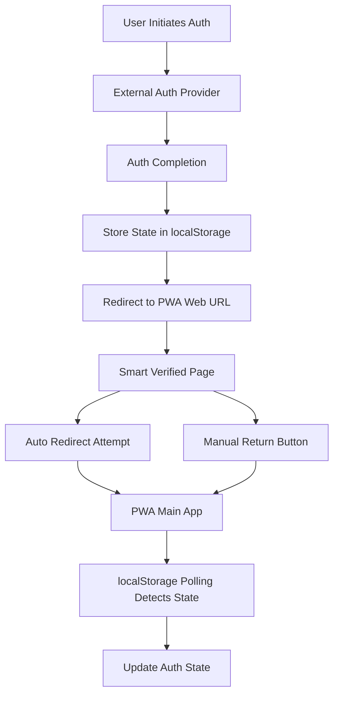

# Design Document

## Overview

This design document outlines the optimization of the PWA authentication redirection system by replacing the current BroadcastChannel-based approach with a unified localStorage polling mechanism. The optimization reduces implementation complexity while maintaining reliability and improving cross-platform compatibility.

The current system uses BroadcastChannel for inter-tab communication and relies on complex redirection flows. The optimized system will use a single localStorage-based state management approach that handles both same-browser tab communication and external app authentication scenarios.

## Architecture

### Current Architecture Issues
- **Dual Channel Complexity**: BroadcastChannel for same-browser communication + separate external app handling
- **Platform Dependencies**: Custom URL schemes requiring platform-specific configurations
- **Limited Fallback**: Manual recovery options not consistently available

### Optimized Architecture
- **Unified State Channel**: Single localStorage polling-based Universal Auth State Manager
- **Simplified Redirection**: Standard web URLs for all authentication flows
- **Enhanced Fallback**: Always-available manual return mechanisms



## Components and Interfaces

### 1. Universal Auth State Manager

**Purpose**: Replace BroadcastChannel with localStorage polling for unified state management

**Interface**:
```typescript
interface UniversalAuthStateManager {
  // State management
  setAuthState(state: AuthState): void;
  getAuthState(): AuthState | null;
  clearAuthState(): void;
  
  // Event handling - simplified interface that manages polling internally
  onStateChange(callback: (state: AuthState | null) => void): () => void;
}

interface AuthState {
  status: 'authenticated' | 'unauthenticated' | 'pending';
  timestamp: number;
  userId?: string;
  sessionToken?: string;
  source: 'internal' | 'external_app';
}
```

**Implementation Details**:
- Uses localStorage key: `easyroom_auth_state`
- Polling interval: 500ms (configurable)
- Automatic cleanup of stale states (>5 minutes)
- Internal polling lifecycle management - external components only subscribe to changes
- Backward compatibility with existing auth tokens

### 2. Simplified Redirection Handler

**Purpose**: Handle authentication redirections using standard web URLs only

**Interface**:
```typescript
interface RedirectionHandler {
  // Redirection methods
  redirectToAuth(provider: string, returnUrl: string): void;
  handleAuthReturn(authResult: AuthResult): void;
  
  // URL management
  buildReturnUrl(baseUrl: string): string;
  parseReturnUrl(url: string): AuthReturnData;
}

interface AuthReturnData {
  success: boolean;
  userId?: string;
  sessionToken?: string;
  error?: string;
}
```

**Implementation Details**:
- Removes custom URL scheme dependencies
- Uses standard HTTPS URLs for all redirections
- Maintains authentication state in localStorage during redirections
- Supports query parameter-based auth result passing

### 3. Smart Verified Page Component

**Purpose**: Enhanced authentication completion page with reliable fallback options

**Interface**:
```typescript
interface SmartVerifiedPageProps {
  autoRedirectDelay?: number; // default: 2000ms
  showManualButton?: boolean; // default: true
  returnUrl?: string;
  onRedirectAttempt?: (success: boolean) => void;
}

interface SmartVerifiedPageState {
  redirectAttempted: boolean;
  redirectSuccess: boolean;
  showFallback: boolean;
}
```

**Implementation Details**:
- Always displays manual "Return to App" button
- Attempts automatic redirection while showing manual options
- Logs redirection attempts and outcomes
- Handles network failures gracefully
- Provides clear user feedback

### 4. One-Time Migration Script

**Purpose**: Handle one-time migration from BroadcastChannel to localStorage system

**Implementation**:
- Runs automatically on app startup when old auth state format is detected
- Transforms existing auth state to new format
- Updates version number in stored state
- Designed for safe removal after migration period (3-6 months)
- No permanent interface - implemented as startup check and migration function

## Data Models

### Auth State Storage Model
```typescript
// localStorage key: 'easyroom_auth_state'
interface StoredAuthState {
  version: string; // '2.0' for optimized system
  state: AuthState;
  metadata: {
    createdAt: number;
    updatedAt: number;
    source: 'internal' | 'external_app' | 'migration';
  };
}
```

### Polling Configuration Model
```typescript
interface PollingConfig {
  interval: number; // milliseconds
  maxAge: number; // maximum age of auth state in milliseconds
  retryAttempts: number;
  backoffMultiplier: number;
}
```

### Redirection Configuration Model
```typescript
interface RedirectionConfig {
  baseUrl: string;
  verifiedPagePath: string; // '/auth/callback/verified'
  autoRedirectDelay: number;
  fallbackEnabled: boolean;
}
```

## Error Handling

### 1. localStorage Access Errors
- **Scenario**: localStorage unavailable (e.g., incognito mode, browser restrictions)
- **Handling**: Stop authentication process and display clear user message
- **Recovery**: Guide user to use standard browser mode for persistent login

### 2. Polling Failures
- **Scenario**: Polling mechanism fails or becomes unresponsive
- **Handling**: Automatic restart with increased interval
- **Recovery**: Manual state refresh option for users

### 3. Redirection Failures
- **Scenario**: Automatic redirection fails due to browser settings or network issues
- **Handling**: Immediate display of manual return button
- **Recovery**: Clear error messaging and alternative return paths

### 4. State Inconsistency
- **Scenario**: Auth state becomes inconsistent between storage and application
- **Handling**: State validation and automatic correction
- **Recovery**: Force re-authentication if correction fails

### 5. Migration Errors
- **Scenario**: Migration from BroadcastChannel system fails
- **Handling**: Preserve existing auth state, log migration issues
- **Recovery**: Manual migration tools for administrators

## Testing Strategy

### 1. Unit Testing
- **Universal Auth State Manager**: State management, polling mechanism, cleanup
- **Redirection Handler**: URL building, parsing, redirection logic
- **Smart Verified Page**: Component behavior, fallback mechanisms
- **Migration Layer**: Legacy compatibility, state migration

### 2. Integration Testing
- **End-to-End Auth Flow**: Complete authentication process from start to finish
- **Cross-Tab Communication**: State synchronization between multiple tabs
- **External App Integration**: Authentication through external applications
- **Fallback Scenarios**: Manual return mechanisms under various failure conditions

### 3. Performance Testing
- **Polling Efficiency**: Resource usage of localStorage polling
- **Memory Management**: Cleanup of event listeners and timers
- **Storage Impact**: localStorage usage patterns and cleanup

### 4. Compatibility Testing
- **Browser Support**: Testing across different browsers and versions
- **PWA Environments**: Testing in various PWA installation scenarios
- **Migration Testing**: Smooth transition from existing BroadcastChannel system

### 5. Security Testing
- **State Tampering**: Protection against localStorage manipulation
- **Cross-Origin Issues**: Proper isolation of auth state
- **Token Security**: Secure handling of authentication tokens in localStorage

## Implementation Phases

### Phase 1: Core Infrastructure
- Implement Universal Auth State Manager
- Create localStorage polling mechanism
- Add basic error handling and logging

### Phase 2: Redirection Optimization
- Replace custom URL schemes with standard web URLs
- Implement simplified redirection handler
- Update authentication provider integrations

### Phase 3: Enhanced User Experience
- Develop Smart Verified Page component
- Add comprehensive fallback mechanisms
- Implement user feedback and error messaging

### Phase 4: Migration and Cleanup
- Implement one-time migration script for startup
- Remove BroadcastChannel dependencies
- Clean up legacy code and configurations
- Plan for migration script removal after transition period

### Phase 5: Testing and Validation
- Comprehensive testing across all scenarios
- Performance optimization
- Security validation and hardening