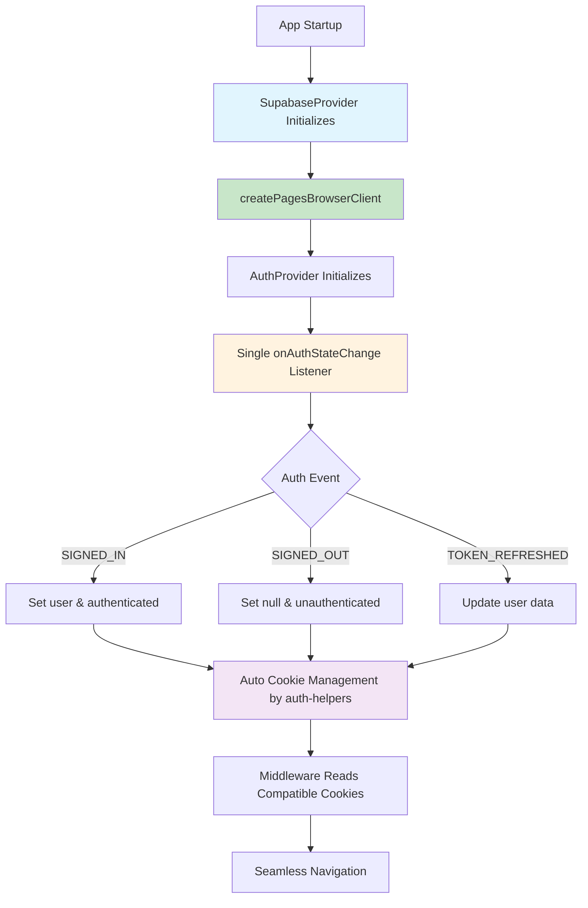

# Design Document

## Overview

This design document outlines the complete migration from custom session management logic to @supabase/auth-helpers-nextjs standard patterns. The solution eliminates race conditions, infinite loading states, and session persistence issues by replacing complex custom synchronization managers with proven auth-helpers client-server integration patterns that are already successfully implemented on the server-side.

## Architecture

### Current Problem Analysis

The console logs reveal three critical issues:

1. **Race Condition**: AuthContext initializes before SupabaseProvider is ready
   ```
   [AuthProvider] Checking session (source: initial, count: 1)...
   [AuthProvider] Supabase client or cookie manager not available, setting unauthenticated state
   [SupabaseProvider] Client initialized successfully  // Too late!
   ```

2. **Infinite Loading Loop**: SessionSynchronizationManager creates endless sync attempts
   ```
   [AuthProvider] Enhanced context value changed: {..., authStatus: 'loading', ...}
   [SessionSynchronizationManager] Starting session sync (sync-1753865676712-siyvubl1e)
   [SessionSynchronizationManager] Starting session sync (sync-1753865677427-tcydb56vw)
   // Never resolves to 'authenticated'
   ```

3. **Client-Server Incompatibility**: Custom client logic vs standard server patterns
   - Server: Uses `createMiddlewareClient` (auth-helpers standard) ✅
   - Client: Uses custom SessionSynchronizationManager, AuthCookieManager ❌

### Proposed Architecture



## Components and Interfaces

### 1. Simplified AuthProvider

**Purpose**: Use only auth-helpers standard patterns for all authentication logic

```typescript
interface AuthContextType {
  user: User | null;
  userProfile: UserProfile | null;
  authStatus: 'loading' | 'authenticated' | 'unauthenticated';
  error: AuthError | null;
  
  // Auth operations (unchanged)
  signInWithMagicLink: (email: string) => Promise<void>;
  signOut: () => Promise<void>;
  // ... other methods
}

// Simplified implementation using ONLY auth-helpers patterns
const AuthProvider: React.FC<{ children: ReactNode }> = ({ children }) => {
  const supabase = useSupabase(); // From SupabaseProvider
  const [user, setUser] = useState<User | null>(null);
  const [authStatus, setAuthStatus] = useState<AuthStatus>('loading');
  
  useEffect(() => {
    // Wait for supabase client to be ready
    if (!supabase) return;
    
    // Single source of truth: onAuthStateChange
    const { data: { subscription } } = supabase.auth.onAuthStateChange(
      (event, session) => {
        console.log('[AuthProvider] Auth event:', event);
        
        if (session?.user) {
          setUser(session.user);
          setAuthStatus('authenticated');
        } else {
          setUser(null);
          setAuthStatus('unauthenticated');
        }
        
        // auth-helpers automatically manages cookies - no custom logic needed!
      }
    );
    
    return () => subscription.unsubscribe();
  }, [supabase]); // Proper dependency array
  
  // ... rest of implementation
};
```

### 2. Enhanced SupabaseProvider

**Purpose**: Ensure proper initialization order and client readiness

```typescript
interface SupabaseContextType {
  client: SupabaseClient<Database> | null;
  isReady: boolean;
}

const SupabaseProvider: React.FC<{ children: ReactNode }> = ({ children }) => {
  const [client, setClient] = useState<SupabaseClient<Database> | null>(null);
  const [isReady, setIsReady] = useState(false);
  
  useEffect(() => {
    // Use auth-helpers standard client creation
    const supabaseClient = createPagesBrowserClient<Database>();
    
    setClient(supabaseClient);
    setIsReady(true);
    
    console.log('[SupabaseProvider] Client initialized with auth-helpers');
  }, []);
  
  return (
    <SupabaseContext.Provider value={{ client, isReady }}>
      {children}
    </SupabaseContext.Provider>
  );
};
```

### 3. Proper Provider Nesting

**Purpose**: Ensure correct initialization order

```typescript
// In layout.tsx or _app.tsx
export default function RootLayout({ children }: { children: ReactNode }) {
  return (
    <html>
      <body>
        <SupabaseProvider>
          <AuthProvider>
            {children}
          </AuthProvider>
        </SupabaseProvider>
      </body>
    </html>
  );
}
```

## Data Models

### Simplified Authentication State

```typescript
// Remove complex state management
type AuthStatus = 'loading' | 'authenticated' | 'unauthenticated';

interface AuthState {
  user: User | null;
  userProfile: UserProfile | null;
  status: AuthStatus;
  error: AuthError | null;
}

// Remove these complex interfaces:
// - SessionSynchronizationManager
// - AuthCookieManager  
// - PWASessionManager
// - SessionState
// - CookieValidationResult
```

### Standard Error Handling

```typescript
interface AuthError {
  message: string;
  type: 'network' | 'auth' | 'unknown';
}

// Simple error handling - let auth-helpers handle the complexity
const handleAuthError = (error: AuthError) => {
  console.error('[AuthProvider] Auth error:', error);
  setError(error);
  // No complex retry logic - auth-helpers handles this
};
```

## Implementation Strategy

### Phase 1: Remove Complex Custom Logic

**Objective**: Delete all custom session management code

```typescript
// Files to DELETE completely:
// - src/lib/auth/SessionSynchronizationManager.ts
// - src/lib/auth/PWASessionManager.ts  
// - src/lib/auth/AuthCookieManager.ts
// - Any other custom session management utilities

// Code patterns to REMOVE from AuthContext:
// - All SessionSynchronizationManager usage
// - All AuthCookieManager usage
// - All PWASessionManager usage
// - Complex cookie validation logic
// - Custom session synchronization attempts
// - Proactive session management
// - Manual cookie generation
```

### Phase 2: Implement auth-helpers Standard Pattern

**Objective**: Replace with single onAuthStateChange listener

```typescript
// NEW simplified AuthContext implementation
const AuthProvider: React.FC<{ children: ReactNode }> = ({ children }) => {
  const supabase = useSupabase();
  const [user, setUser] = useState<User | null>(null);
  const [userProfile, setUserProfile] = useState<UserProfile | null>(null);
  const [authStatus, setAuthStatus] = useState<AuthStatus>('loading');
  const [error, setError] = useState<AuthError | null>(null);

  // Single useEffect for all authentication logic
  useEffect(() => {
    if (!supabase) {
      console.log('[AuthProvider] Waiting for Supabase client...');
      return;
    }

    console.log('[AuthProvider] Setting up auth state listener');

    const { data: { subscription } } = supabase.auth.onAuthStateChange(
      async (event, session) => {
        console.log('[AuthProvider] Auth event:', event, session ? 'with session' : 'no session');
        
        try {
          if (session?.user) {
            setUser(session.user);
            
            // Load user profile if needed
            const profile = await loadUserProfile(session.user.id);
            setUserProfile(profile);
            
            setAuthStatus('authenticated');
            setError(null);
          } else {
            setUser(null);
            setUserProfile(null);
            setAuthStatus('unauthenticated');
            setError(null);
          }
        } catch (err) {
          console.error('[AuthProvider] Error handling auth state change:', err);
          setError({
            message: err.message || 'Authentication error',
            type: 'auth'
          });
          setAuthStatus('unauthenticated');
        }
      }
    );

    return () => {
      console.log('[AuthProvider] Cleaning up auth listener');
      subscription.unsubscribe();
    };
  }, [supabase]); // Proper dependency array

  // Auth operations remain the same but simplified
  const signInWithMagicLink = useCallback(async (email: string) => {
    if (!supabase) throw new Error('Supabase client not ready');
    
    const { error } = await supabase.auth.signInWithOtp({
      email,
      options: { emailRedirectTo: `${window.location.origin}/auth/callback` }
    });
    
    if (error) throw error;
    // No manual session management - auth-helpers handles everything!
  }, [supabase]);

  const signOut = useCallback(async () => {
    if (!supabase) throw new Error('Supabase client not ready');
    
    const { error } = await supabase.auth.signOut();
    if (error) throw error;
    // No manual cookie clearing - auth-helpers handles everything!
  }, [supabase]);

  const contextValue = useMemo(() => ({
    user,
    userProfile,
    authStatus,
    error,
    signInWithMagicLink,
    signOut,
    // ... other methods
  }), [user, userProfile, authStatus, error, signInWithMagicLink, signOut]);

  return (
    <AuthContext.Provider value={contextValue}>
      {children}
    </AuthContext.Provider>
  );
};
```

### Phase 3: Update SupabaseProvider

**Objective**: Use createPagesBrowserClient for proper auth-helpers integration

```typescript
// Update SupabaseProvider to use auth-helpers
import { createPagesBrowserClient } from '@supabase/auth-helpers-nextjs';

const SupabaseProvider: React.FC<{ children: ReactNode }> = ({ children }) => {
  const [client, setClient] = useState<SupabaseClient<Database> | null>(null);
  const [isReady, setIsReady] = useState(false);

  useEffect(() => {
    console.log('[SupabaseProvider] Initializing with auth-helpers...');
    
    // This is the key change - use auth-helpers client creation
    const supabaseClient = createPagesBrowserClient<Database>();
    
    setClient(supabaseClient);
    setIsReady(true);
    
    console.log('[SupabaseProvider] Client ready with auth-helpers integration');
  }, []);

  const contextValue = useMemo(() => ({
    client,
    isReady
  }), [client, isReady]);

  return (
    <SupabaseContext.Provider value={contextValue}>
      {children}
    </SupabaseContext.Provider>
  );
};
```

## Error Handling

### Simplified Error Strategy

```typescript
// Remove complex error recovery strategies
// Let auth-helpers handle the complexity

const handleAuthError = (error: any) => {
  console.error('[AuthProvider] Authentication error:', error);
  
  // Simple error categorization
  const authError: AuthError = {
    message: error.message || 'Authentication failed',
    type: error.name === 'NetworkError' ? 'network' : 'auth'
  };
  
  setError(authError);
  setAuthStatus('unauthenticated');
  
  // No complex retry logic - auth-helpers handles retries automatically
};
```

## Testing Strategy

### Unit Tests

1. **AuthProvider Tests**
   - Test initialization waits for Supabase client
   - Test onAuthStateChange event handling
   - Test proper cleanup on unmount
   - Test error handling

2. **SupabaseProvider Tests**
   - Test client creation with createPagesBrowserClient
   - Test initialization order
   - Test context value provision

### Integration Tests

1. **Authentication Flow Tests**
   - Test complete login flow with auth-helpers
   - Test session persistence across page refreshes
   - Test logout flow
   - Test automatic token refresh

2. **Race Condition Tests**
   - Test that AuthProvider waits for SupabaseProvider
   - Test proper dependency array behavior
   - Test no premature unauthenticated state setting

## Performance Considerations

### Memory Management
- Single onAuthStateChange listener instead of multiple managers
- Proper cleanup with subscription.unsubscribe()
- Memoized context values to prevent unnecessary re-renders

### Network Efficiency
- Let auth-helpers handle token refresh automatically
- No custom polling or synchronization attempts
- Efficient session state management

## Migration Benefits

### Eliminated Complexity
- No more SessionSynchronizationManager (200+ lines removed)
- No more AuthCookieManager (150+ lines removed)  
- No more PWASessionManager (100+ lines removed)
- No more custom cookie validation logic

### Improved Reliability
- Standard auth-helpers patterns proven in production
- Automatic cookie format compatibility
- Built-in error handling and retry logic
- No race conditions between custom managers

### Better Maintainability
- Single source of truth: onAuthStateChange
- Standard patterns that other developers understand
- Reduced debugging complexity
- Clear separation of concerns