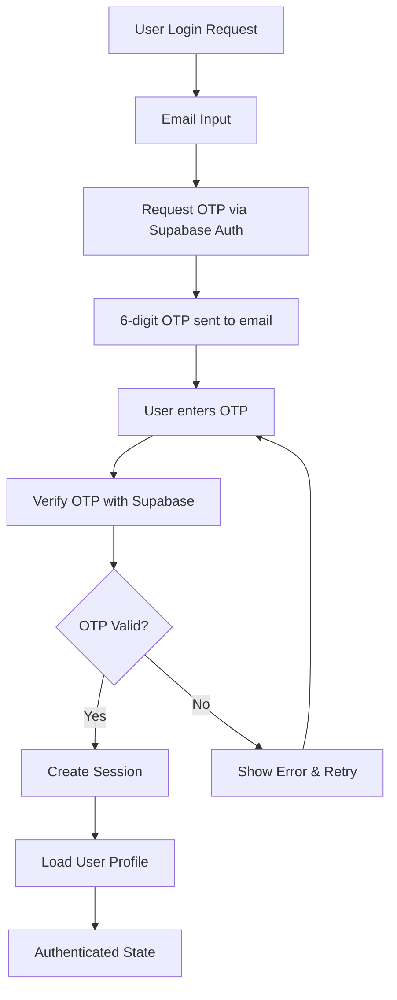

# Design Document

## Overview

This design outlines the migration from the current Magic Link authentication system to Supabase Email OTP authentication. The system will maintain the existing user experience for signup while replacing the magic link login flow with a 6-digit OTP code sent via email. The design ensures seamless PWA functionality, maintains all existing user data and permissions, and provides a smooth transition for current users.

## Architecture

### Current System Analysis

The existing system uses:
- **Magic Link Authentication**: `signInWithOtp()` with `shouldCreateUser: false`
- **Direct Signup**: Temporary password-based signup followed by immediate logout
- **AuthContext**: Centralized authentication state management
- **Enhanced Client Manager**: Robust Supabase client initialization with retry logic
- **User Profile Management**: Automatic profile creation via `upsert_user_profile` RPC function

### New OTP System Architecture



### Migration Strategy

The migration will be implemented as a **feature flag approach**:
1. **Phase 1**: Implement OTP system alongside existing magic link system
2. **Phase 2**: Switch default login method to OTP
3. **Phase 3**: Remove magic link code after successful deployment

## Components and Interfaces

### 1. Authentication Hook Updates (`useAuth`)

**New Methods:**
```typescript
interface AuthHook {
  // New OTP methods
  requestOTP: (email: string) => Promise<void>;
  verifyOTP: (email: string, token: string) => Promise<void>;
  
  // Existing methods (maintained for compatibility)
  signInWithMagicLink: (email: string) => Promise<void>;
  signUpDirectly: (email: string, fullName: string, department: string) => Promise<void>;
  signOut: () => Promise<void>;
}
```

**Implementation Details:**
- Use `supabase.auth.signInWithOtp({ email, type: 'email' })` for OTP request
- Use `supabase.auth.verifyOtp({ email, token, type: 'email' })` for verification
- Maintain existing error handling patterns
- Preserve all existing user profile creation logic

### 2. New OTP Input Component

**Component Structure:**
```typescript
interface OTPInputProps {
  length: number; // 6 digits
  onComplete: (otp: string) => void;
  onResend: () => void;
  isLoading: boolean;
  error?: string;
  timeRemaining: number;
}
```

**Features:**
- 6 individual input fields with auto-focus progression
- Automatic paste handling for 6-digit codes
- Backspace navigation between fields
- Mobile-optimized numeric keypad trigger
- Accessibility support with proper ARIA labels
- Auto-fill support using `autocomplete="one-time-code"`

### 3. Updated Login Flow Components

**LoginForm Modifications:**
- Add OTP verification step after email submission
- Maintain existing UI/UX patterns and styling
- Show countdown timer for OTP expiration (5 minutes)
- Provide "Resend OTP" functionality
- Handle offline scenarios with appropriate messaging

**New Components:**
- `OTPInput`: Reusable 6-digit input component
- `OTPVerificationForm`: Complete OTP verification flow
- `LoginMethodSelector`: Optional component for choosing between magic link and OTP (during transition)

### 4. PWA Enhancements

**Offline Handling:**
```typescript
interface OfflineManager {
  isOnline: boolean;
  showOfflineMessage: () => void;
  checkConnectivity: () => boolean;
}
```

**PWA-Specific Features:**
- Simple offline detection and user messaging
- Clear indication that internet connection is required for OTP requests
- Proper handling of app backgrounding during OTP entry
- Retry functionality when connectivity is restored

## Data Models

### User Authentication Flow

The existing user data model remains unchanged:

```typescript
interface UserProfile {
  authId: AuthId;
  dbId: DatabaseUserId;
  employeeId: string | null;
  email: string;
  name: string;
  department: string;
  role: 'admin' | 'employee';
  createdAt: string;
  updatedAt: string;
}
```

### OTP Session Management

```typescript
interface OTPUIState {
  email: string;
  isLoading: boolean;
  error: string | null;
  attemptsRemaining: number;
  canResend: boolean;
}
```

**Storage Strategy:**
- Use minimal React state for UI-specific data only
- Rely on Supabase as the single source of truth for OTP validity and expiration
- No client-side session tracking or expiration management
- Server-side validation determines all OTP state

## Error Handling

### OTP-Specific Error Scenarios

1. **Invalid OTP Code**
   - Show clear error message
   - Allow up to 3 retry attempts
   - Provide option to request new OTP

2. **Expired OTP**
   - Automatic detection when 5-minute window expires
   - Clear error message with resend option
   - Reset attempt counter

3. **Rate Limiting**
   - Handle Supabase rate limiting gracefully
   - Show appropriate wait time messages
   - Implement exponential backoff for resend requests

4. **Network Issues**
   - Offline detection and clear messaging
   - Simple retry functionality when connectivity returns
   - No queuing - require online connection for OTP requests

### Error Message Strategy

```typescript
interface OTPError {
  type: 'invalid_otp' | 'expired_otp' | 'rate_limited' | 'network_error' | 'max_attempts';
  message: string;
  canRetry: boolean;
  retryAfter?: number;
}
```

## Testing Strategy

### Unit Tests

1. **OTP Input Component**
   - Digit input and navigation
   - Paste functionality
   - Accessibility features
   - Mobile keyboard behavior

2. **Authentication Hook**
   - OTP request and verification flows
   - Error handling scenarios
   - State management

3. **Form Validation**
   - Email format validation
   - OTP format validation (6 digits)
   - Error state handling

### Integration Tests

1. **Complete Login Flow**
   - Email submission → OTP request → OTP verification → Authentication
   - Error scenarios and recovery
   - PWA offline/online transitions

2. **Migration Compatibility**
   - Existing magic link sessions remain valid
   - User profile data preservation
   - Permission system integrity

### PWA Testing

1. **Offline Scenarios**
   - Clear messaging when OTP request attempted offline
   - App backgrounding during OTP entry
   - Retry functionality when connectivity is restored

2. **Mobile Device Testing**
   - Numeric keypad activation
   - Auto-fill functionality
   - Touch interaction optimization

## Migration Implementation Plan

### Phase 1: Parallel Implementation
- Implement OTP system alongside existing magic link
- Add feature flag to control which method is used
- Comprehensive testing in development environment

### Phase 2: Gradual Rollout
- Enable OTP for new users first
- Provide option for existing users to switch
- Monitor system performance and user feedback

### Phase 3: Complete Migration
- Make OTP the default authentication method
- Maintain magic link support for existing sessions
- Plan deprecation timeline for magic link code

### Rollback Strategy
- Feature flag allows instant rollback to magic link
- Database schema remains unchanged
- User sessions and data unaffected by rollback

## Security Considerations

### OTP Security
- 6-digit codes provide adequate security for email-based OTP
- 5-minute expiration window balances security and usability
- Rate limiting prevents brute force attacks
- Automatic invalidation of previous codes when new ones are requested

### Session Management
- Maintain existing session security patterns
- No changes to JWT token handling
- Preserve existing logout and session cleanup logic

### Data Protection
- No additional sensitive data storage required
- Existing user data encryption and protection maintained
- OTP codes never stored in application state or logs

## Performance Considerations

### OTP Delivery
- Supabase handles email delivery infrastructure
- No additional email service integration required
- Built-in rate limiting and delivery optimization

### Client-Side Performance
- Minimal impact on bundle size (small OTP input component)
- Efficient state management for OTP session
- Optimized re-renders during OTP entry

### PWA Performance
- Minimal additional storage requirements
- Efficient state management for OTP UI
- Simple offline detection without complex background sync

## Accessibility

### OTP Input Accessibility
- Proper ARIA labels for screen readers
- Keyboard navigation support
- High contrast mode compatibility
- Focus management for seamless user experience

### Error Communication
- Clear, descriptive error messages
- Screen reader compatible error announcements
- Visual and textual error indicators

### Mobile Accessibility
- Touch target optimization
- Voice input compatibility
- Assistive technology support